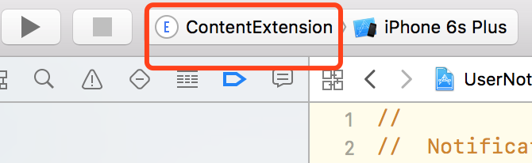
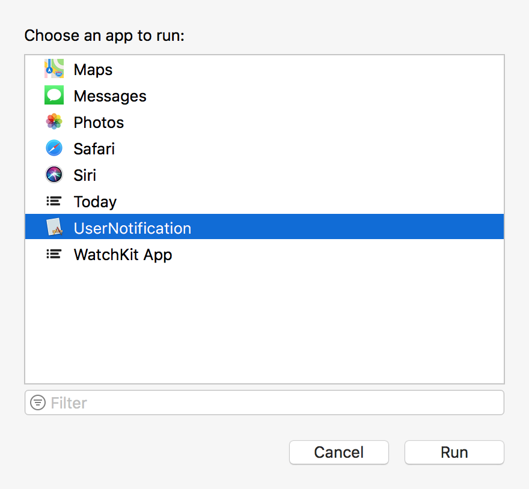
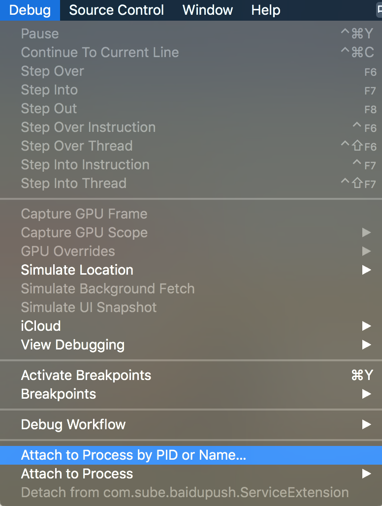
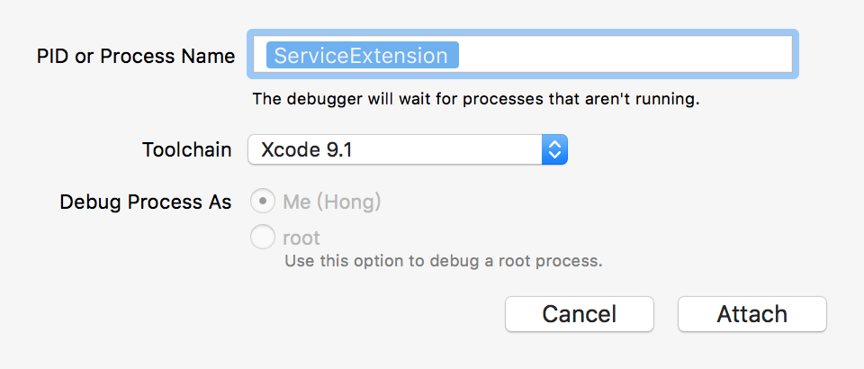

## App Extension Tips

### 调试 extension

>怎么断点调试 extension 里面的代码？

这算是在开发extension中，几乎每个人都会遇到的问题了。这里说一下两种情况，一种是大部分的 extension 的调试方法：



在运行时选中你要调试的 extension 的 target



然后选择你的主程序的。

除此之外，还有特殊情况，比如 UNNotificationServiceExtension 的调试，因为该代码完全处于后台情况（不像UNNotificationContentExtension可以由通知界面打开触发），像上面那种方式调试还是不会走断点，这就需要`Debug -> Attach to process by pID or name`：





在这里填写 extension target 就好了。


### 多个target直接，本地bundle内的图片、字体、视频等资源共享。

选中要共享的资源，在xcode右侧的Show the File inspector，在Target Membership里选中要共享的target。


### Today Extension 内存警告

对扩展的内存要求限制比较大，iphone 6p Today Extension 内存占用到15M差不多就会内存警告，持续则会被系统杀掉。

如果扩展做的比较复杂，图片是占内存的主要因素，可用如下方法将图片压缩。

```
UIGraphicsBeginImageContextWithOptions(theNewSize, NO, 1.0);
[theImage drawInRect:CGRectMake(0, 0, theNewSize.width, theNewSize.height)];
UIImage *newImage = UIGraphicsGetImageFromCurrentImageContext();
UIGraphicsEndImageContext();
return newImage;
```

### Today Extension 最大高度

iOS10以下，最多显示一屏today extension内容的高度。
iOS10以后，有获取当前mode下最大高度的方法，

```
[self.extensionContext widgetMaximumSizeForDisplayMode:NCWidgetDisplayModeExpanded]
```

### iOS10 Today Extension 标题自动大写