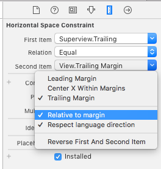
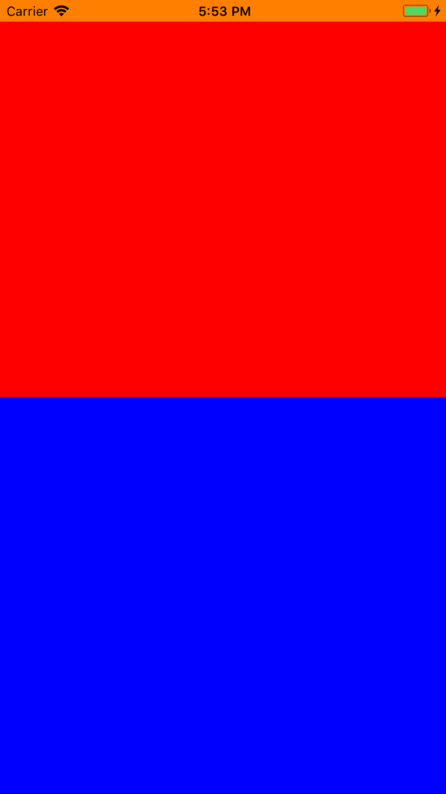
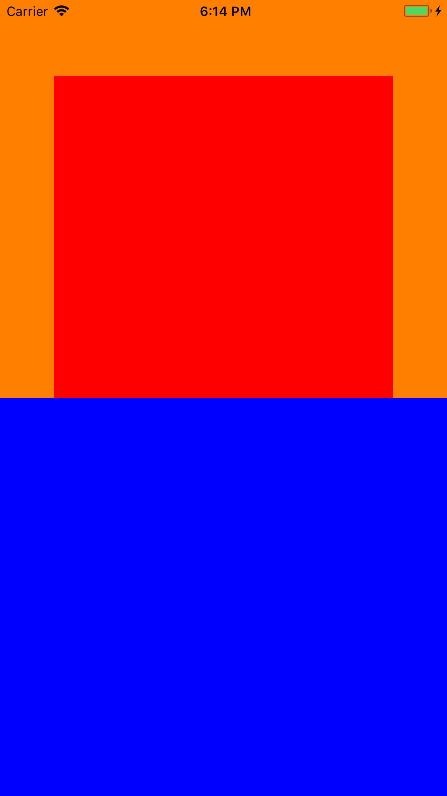

## UIView的Margins

### 写在前面

之前使用Storyboard拖拽约束时，可以看到比较的view有margin选项，来支持相对某view的margin进行布局。



那么在代码中如何体现，就需要UIView的以下API:

- layoutMargins
- directionalLayoutMargins
- preservesSuperviewLayoutMargins

iOS11引入了Safe Area的概念，相应对UIView的Margin也增加以下API:

- insetsLayoutMarginsFromSafeArea


#### layoutMargins

这个属性用于指定视图和它的子视图之间的边距。和preservesSuperviewLayoutMargins一起在iOS8开始引入。

AutoLayout中NSLayoutAttribute的枚举值也有相应的更新：

```
	NSLayoutAttributeLeftMargin NS_ENUM_AVAILABLE_IOS(8_0),
    NSLayoutAttributeRightMargin NS_ENUM_AVAILABLE_IOS(8_0),
    NSLayoutAttributeTopMargin NS_ENUM_AVAILABLE_IOS(8_0),
    NSLayoutAttributeBottomMargin NS_ENUM_AVAILABLE_IOS(8_0),
    NSLayoutAttributeLeadingMargin NS_ENUM_AVAILABLE_IOS(8_0),
    NSLayoutAttributeTrailingMargin NS_ENUM_AVAILABLE_IOS(8_0),
    NSLayoutAttributeCenterXWithinMargins NS_ENUM_AVAILABLE_IOS(8_0),
    NSLayoutAttributeCenterYWithinMargins NS_ENUM_AVAILABLE_IOS(8_0),
```

在VFL（Visual Format Language）语法中也有相应的引入，比如“|-[subview]-|”，设置Margin约束。

子视图采用上面的约束与父视图建立约束时，父视图的layoutMarigin才会生效。

场景一：blueView占据全屏，它的子视图orangeView相对它的margin布局

```
	UIView *blueView = [[UIView alloc] init];
    blueView.backgroundColor = [UIColor blueColor];
    blueView.translatesAutoresizingMaskIntoConstraints = NO;
    [self.view addSubview:blueView];
    [blueView mas_makeConstraints:^(MASConstraintMaker *make) {
        make.edges.mas_equalTo(self.view);
    }];
    
    UIView *orangeView = [[UIView alloc] init];
    orangeView.backgroundColor = [UIColor orangeColor];
    orangeView.translatesAutoresizingMaskIntoConstraints = NO;
    [blueView addSubview:orangeView];
    [orangeView mas_makeConstraints:^(MASConstraintMaker *make) {
        make.top.mas_equalTo(blueView.mas_topMargin);
        make.bottom.mas_equalTo(blueView.mas_bottomMargin);
        make.left.mas_equalTo(blueView.mas_leftMargin);
        make.right.mas_equalTo(blueView.mas_rightMargin);
    }];

    blueView.layoutMargins = UIEdgeInsetsMake(50, 50, 50, 50);

```

效果：


可以看到orangeView相对上下左右有个比较大的margin。（这里肉左右下的margin是50，但是肉眼看距离上面的margin似乎要比左右下的margin大，这是因为iOS11的Safe Area，下面会讲到）

除了layoutMargins，iOS11还增加了一个新属性**directionalLayoutMargins**，这个属性的类型不是UIEdgeInsets，而是NSDirectionalEdgeInsets，定义如下：

```
typedef struct UIEdgeInsets {
    CGFloat top, left, bottom, right;
} UIEdgeInsets;

typedef struct NSDirectionalEdgeInsets {
    CGFloat top, leading, bottom, trailing;  
} NSDirectionalEdgeInsets API_AVAILABLE(ios(11.0),tvos(11.0),watchos(4.0));
```

从结构上看主要是将UIEdgeInsets结构的left和right调整为NSDirectionalEdgeInsets结构的leading和trailing。这一调整主要是为了Right To Left（RTL）语言下可以进行自动适配。


#### preservesSuperviewLayoutMargins

当这个属性的值为YES的时候，一个视图布局内容时其父视图的margins也会被考虑在内。默认是NO。

场景二：blueView占据全屏，它的子视图orangeView相对blueView的边距布局，orangeView的子视图redView相对orangeView的margin布局。

```
	UIView *blueView = [[UIView alloc] init];
    blueView.backgroundColor = [UIColor blueColor];
    blueView.translatesAutoresizingMaskIntoConstraints = NO;
    [self.view addSubview:blueView];
    [blueView mas_makeConstraints:^(MASConstraintMaker *make) {
        make.edges.mas_equalTo(self.view);
    }];
    
    UIView *orangeView = [[UIView alloc] init];
    orangeView.backgroundColor = [UIColor orangeColor];
    orangeView.translatesAutoresizingMaskIntoConstraints = NO;
    [blueView addSubview:orangeView];
    [orangeView mas_makeConstraints:^(MASConstraintMaker *make) {
        make.left.right.top.mas_equalTo(blueView);
        make.width.mas_equalTo(blueView);
        make.height.mas_equalTo(blueView).multipliedBy(0.5);
    }];
    
    UIView *redView = [[UIView alloc] init];
    redView.backgroundColor = [UIColor redColor];
    redView.translatesAutoresizingMaskIntoConstraints = NO;
    [orangeView addSubview:redView];
    [redView mas_makeConstraints:^(MASConstraintMaker *make) {
        make.top.mas_equalTo(orangeView.mas_topMargin);
        make.bottom.mas_equalTo(orangeView.mas_bottomMargin);
        make.left.mas_equalTo(orangeView.mas_leftMargin);
        make.right.mas_equalTo(orangeView.mas_rightMargin);
    }];

    blueView.layoutMargins = UIEdgeInsetsMake(50, 50, 50, 50);
    orangeView.preservesSuperviewLayoutMargins = YES;
    orangeView.layoutMargins = UIEdgeInsetsZero;
```

效果：


其中`orangeView.preservesSuperviewLayoutMargins = YES;`就设置了orangeView保持父视图的layoutMargins，下面没有保持父视图的边距是因为，orangeView不在父视图的bottomMargin内。

如果把``orangeView.preservesSuperviewLayoutMargins = YES;``这句代码去掉或者设置为NO，效果如下：



这里忽略上边距（iOS11 Safe Area引起，后面讲），发现redView的左右边距不再相对爷爷视图，也就是blueView的Margin对齐了，这是因为视图orangeView没有保持blueView的layoutMargin。

接下来我们把代码修改为：

```
	 blueView.layoutMargins = UIEdgeInsetsMake(50, 50, 50, 50);
    orangeView.preservesSuperviewLayoutMargins = YES;
    orangeView.layoutMargins = UIEdgeInsetsMake(0, 50, 0, 0);
```

也就是我们想要orangeView保持父视图的Margin的基础上，增加自己的左Margin，效果如下：



发现效果和orangeView没有自己的Margin时一样，这是因为视图本身的Margin和从父视图保持来的Margin是重合的。也就是说preservesSuperviewLayoutMargins=YES时，真正layoutMargins的值是，“手动设置layoutMargins值”与”在父视图Margin范围内区域“的最大值，伪代码表示如下：

```
layoutMargins = Max(self.layoutMargins, Combine(self.superview.layoutMargins, self.frame));
```

#### iOS11的insetsLayoutMarginsFromSafeArea

从iOS 7以来，我们在整个操作系统中都有这些半透明的bars，苹果鼓励我们通过这些bars绘制内容，我们是通过viewController的edgesForExtendedLayout属性来做这些的。

iOS11的Safe Area的出现，很快将iOS7出现的topLayoutGuide、bottomLayoutGuide废弃。Safe Area定义了view中可视区域的部分，保证不被系统的状态栏、或父视图提供的view如导航栏覆盖。

UIView的**safeAreaInsets**属性反映了一个view距离该view的安全区域的边距。对于一个Controller的根视图而言，SafeAreaInsets值包括了被statusbar和其他可视的bars覆盖的区域和其他通过additionalSafeAreaInsets自定义的insets值。对于view层次中得其他view，SafeAreaInsets值反映了view被覆盖的部分。如果一个view全部在它父视图的安全区域内，则SafeAreaInsets值为(0,0,0,0)。

说了这么多终于到**insetsLayoutMarginsFromSafeArea**了，从名字就可以看出来它和layoutMargins和safeAreaInsets有一定联系。我们通过下面的场景来证明一下：

我们想要看一个view在真正布局时的safeAreaInsets值和layoutMargins值，这样写一个UIView的子类TestView，重写父类的layoutSubviews方法，打印出这两个值，并把上面的三个视图改成TestView的实例：

```
- (void)layoutSubviews
{
    [super layoutSubviews];
    NSLog(@"%@", self);
    NSLog(@"safeAreaInsets : %@",  [NSValue valueWithUIEdgeInsets:self.safeAreaInsets]); //safeAreaInsets是iOS11才有的属性，注意使用时判断系统版本
    NSLog(@"layoutMargins : %@",  [NSValue valueWithUIEdgeInsets:self.layoutMargins]);
}
```

将上面三个视图的layoutMargin设置为：

```
	blueView.layoutMargins = UIEdgeInsetsMake(50, 50, 50, 50);
   	orangeView.layoutMargins = UIEdgeInsetsMake(0, 50, 0, 0);
```

控制台打印：

```
//blueView
safeAreaInsets : UIEdgeInsets: {20, 0, 0, 0}
layoutMargins : UIEdgeInsets: {70, 50, 50, 50}

//orangeView
safeAreaInsets : UIEdgeInsets: {20, 0, 0, 0}
layoutMargins : UIEdgeInsets: {20, 50, 0, 0}

//redView
safeAreaInsets : UIEdgeInsets: {0, 0, 0, 0}
layoutMargins : UIEdgeInsets: {8, 8, 8, 8}
```

打印的layoutMargin和设置的layoutMargin值不一样，视图真正显示时的layoutMargin其实是设置的layoutMargin和safeAreaInsets的累加。那么跟insetsLayoutMarginsFromSafeArea属性有什么关系呢，这个值默认是YES，我们把它设置为NO：

```
	blueView.layoutMargins = UIEdgeInsetsMake(50, 50, 50, 50);
   	orangeView.layoutMargins = UIEdgeInsetsMake(0, 50, 0, 0);
   	orangeView.insetsLayoutMarginsFromSafeArea = NO;
```

控制台打印：

```
//orangeView
safeAreaInsets : UIEdgeInsets: {20, 0, 0, 0}
layoutMargins : UIEdgeInsets: {0, 50, 0, 0}
```

发现safeAreaInsets不再累加到layoutMargins上了，所以insetsLayoutMarginsFromSafeArea属性也很简单，就是控制safeAreaInsets是否加到layoutMargins上。

另外，从打印结果看，safeAreaInsets的值就是status bar的高度，也说明了我们之前的效果上面的边距要多出一点的原因。

### 总结

本文主要讲了UIView关于Margin的以下属性：

- **layoutMargins**： iOS8开始引入，用于指定视图和它的子视图之间的边距。
- **directionalLayoutMargins**：iOS11开始引入，可以根据语言的方向进行前后布局，与layoutMargins相比，能更好的适配RTL语言。
- **preservesSuperviewLayoutMargins**：iOS8开始引入，当这个属性的值为YES的时候，一个视图布局内容时其父视图的margins也会被考虑在内。默认是NO。
- **insetsLayoutMarginsFromSafeArea**：iOS11开始引入，控制safeAreaInsets是否加到layoutMargins上。默认YES。

**他们之间的关系：**

第一步：一个视图“真正的layoutMargins”是否受父视图的layoutMargins影响，取决于preservesSuperviewLayoutMargins值，如果NO，则不考虑父视图layoutMargins，如果YES，受影响值为视图在父视图的margin的区域，然后取“设置的layoutMargins”与“在父视图的margin区域”的最大值。

第二步：再判断视图是否受Safe Area影响，判断insetsLayoutMarginsFromSafeArea值，如果NO，直接使用，如果YES，则将从上面得到的layoutMargins加上safeAreaInsets（注意这里是加上，前面与父视图margin的影响区域是取最大值），得到最终真正的layoutMargins。

伪代码表示如下：


```
- (UIEdgeInsets)getRealLayoutMargins {
    UIEdgeInsets layoutMargins = UIEdgeInsetsMake(8, 8, 8, 8);  //默认是8

    if (self.preservesSuperviewLayoutMargins) {
        layoutMargins = Max(settingsLayoutMargins, Combine(self.superview.layoutMargins, self.frame));
    }

    if (self.insetsLayoutMarginsFromSafeArea) {
        layoutMargins = Add(layoutMargins, self.safeAreaInsets);
    }
    
 	return layoutMargins;
}
```

### 参考

- [layoutMargins和preservesSuperviewLayoutMargins
](http://www.jianshu.com/p/4237bd89f521)