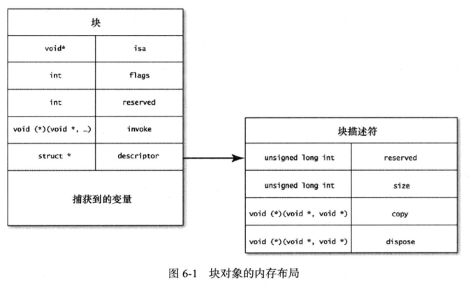

## Block

### 定义

块与函数类似，只不过是直接定义在另一个函数里，和定义它的那个函数共享同一个范围内的东西。

### 访问外部变量

堆块内部，栈是红灯区，堆是绿灯区。

根据块的存储位置，可将块分为全局块、栈块、堆块。这里先主要针对堆块讲解。
     
>Block不允许修改外部变量的值。Apple这样设计，应该是考虑到了block的特殊性，block也属于“函数”的范畴，变量进入block，实际就是已经改变了作用域。在几个作用域之间进行切换时，如果不加上这样的限制，变量的可维护性将大大降低。又比如我想在block内声明了一个与外部同名的变量，此时是允许呢还是不允许呢？只有加上了这样的限制，这样的情景才能实现。于是栈区变成了红灯区，堆区变成了绿灯区。

#### 几种演算

- block调用 基本数据类型

``` 
    {
        NSLog(@"\n--------------------block调用 基本数据类型---------------------\n");

        int a = 10;
        NSLog(@"block定义前a地址=%p", &a);
        void (^aBlock)() = ^(){
            NSLog(@"block定义内部a地址=%p", &a);
        };
        NSLog(@"block定义后a地址=%p", &a);
        aBlock();
    }
    
    /*
     结果：
     block定义前a地址=0x7fff5bdcea8c
     block定义后a地址=0x7fff5bdcea8c
     block定义内部a地址=0x7fa87150b850
     */
    
    /*
     流程：
     1. block定义前：a在栈区
     2. block定义内部：里面的a是根据外面的a拷贝到堆中的，不是一个a
     3. block定义后：a在栈区
     */
    
    {
        NSLog(@"\n--------------------block调用 __block修饰的基本数据类型---------------------\n");
        
        __block int b = 10;
        NSLog(@"block定义前b地址=%p", &b);
        void (^bBlock)() = ^(){
            b = 20;
            NSLog(@"block定义内部b地址=%p", &b);
        };
        NSLog(@"block定义后b地址=%p", &b);
        NSLog(@"调用block前 b=%d", b);
        bBlock();
        NSLog(@"调用block后 b=%d", b);
    }
    
    /*
     结果：
     block定义前b地址=0x7fff5bdcea50
     block定义后b地址=0x7fa873b016d8
     调用block前 b=10
     block定义内部b地址=0x7fa873b016d8
     调用block后 b=20
     */
    
    /*
     流程：
     1. 声明 b 为 __block （__block 所起到的作用就是只要观察到该变量被 block 所持有，就将“外部变量”在栈中的内存地址放到了堆中。）
     2. block定义前：b在栈中。
     3. block定义内部： 将外面的b拷贝到堆中，并且使外面的b和里面的b是一个。
     4. block定义后：外面的b和里面的b是一个。
     5. block调用前：b的值还未被修改。
     6. block调用后：b的值在block内部被修改。
     */
    
    {
        NSLog(@"\n--------------------block调用 指针---------------------\n");
        
        NSString *c = @"ccc";
        NSLog(@"block定义前：c=%@, c指向的地址=%p, c本身的地址=%p", c, c, &c);
        void (^cBlock)() = ^{
            NSLog(@"block定义内部：c=%@, c指向的地址=%p, c本身的地址=%p", c, c, &c);
        };
        NSLog(@"block定义后：c=%@, c指向的地址=%p, c本身的地址=%p", c, c, &c);
        cBlock();
        NSLog(@"block调用后：c=%@, c指向的地址=%p, c本身的地址=%p", c, c, &c);
    }
    
    /*
     c指针本身在block定义中和外面不是一个，但是c指向的地址一直保持不变。
     1. block定义前：c指向的地址在堆中， c指针本身的地址在栈中。
     2. block定义内部：c指向的地址在堆中， c指针本身的地址在堆中（c指针本身和外面的不是一个，但是指向的地址和外面指向的地址是一样的）。
     3. block定义后：c不变，c指向的地址在堆中， c指针本身的地址在栈中。
     4. block调用后：c不变，c指向的地址在堆中， c指针本身的地址在栈中。
     */

    {
        NSLog(@"\n--------------------block调用 指针并修改值---------------------\n");
        
        NSMutableString *d = [NSMutableString stringWithFormat:@"ddd"];
        NSLog(@"block定义前：d=%@, d指向的地址=%p, d本身的地址=%p", d, d, &d);
        void (^dBlock)() = ^{
            NSLog(@"block定义内部：d=%@, d指向的地址=%p, d本身的地址=%p", d, d, &d);
            d.string = @"dddddd";
        };
        NSLog(@"block定义后：d=%@, d指向的地址=%p, d本身的地址=%p", d, d, &d);
        dBlock();
        NSLog(@"block调用后：d=%@, d指向的地址=%p, d本身的地址=%p", d, d, &d);
    }
    
    /*
     d指针本身在block定义中和外面不是一个，但是d指向的地址一直保持不变。
     在block调用后，d指向的堆中存储的值发生了变化。
     */
    
    {
        NSLog(@"\n--------------------block调用 __block修饰的指针---------------------\n");
        
        __block NSMutableString *e = [NSMutableString stringWithFormat:@"eee"];
        NSLog(@"block定义前：e=%@, e指向的地址=%p, e本身的地址=%p", e, e, &e);
        void (^eBlock)() = ^{
            NSLog(@"block定义内部：e=%@, e指向的地址=%p, e本身的地址=%p", e, e, &e);
            e = [NSMutableString stringWithFormat:@"new-eeeeee"];
        };
        NSLog(@"block定义后：e=%@, e指向的地址=%p, e本身的地址=%p", e, e, &e);
        eBlock();
        NSLog(@"block调用后：e=%@, e指向的地址=%p, e本身的地址=%p", e, e, &e);
    }
    
    /*
     从block定义内部使用__block修饰的e指针开始，e指针本身的地址由栈中改变到堆中，即使出了block，也在堆中。
     在block调用后，e在block内部重新指向一个新对象,e指向的堆中的地址发生了变化。
     */
    
    {
        NSLog(@"\n--------------------block调用 retain cycle---------------------\n");
        
        View *v = [[View alloc] init];
        v.tag = 1;
        v.frame = CGRectMake(100, 100, 100, 100);
        [self.view addSubview:v];      //self->view->v
        void (^block)() = ^{
            v.backgroundColor = [UIColor orangeColor]; //定义内部：block->v
        };
        v.block = block;    //v->block
        block();   
        dispatch_after(dispatch_time(DISPATCH_TIME_NOW, (int64_t)(3 * NSEC_PER_SEC)), dispatch_get_main_queue(), ^{
            //预计3秒后释放v对象。
            [v removeFromSuperview];
        });
    }
    
    /*
     结果：
     不会输出 dealloc.
     */
    
    /*
     流程：
     1. self->view->v
     2. block定义内部：block->v 因为block定义里面调用了v
     3. v->block
     
     结论：
     引起循环引用的是block->v->block，切断其中一个线即可解决循环引用，跟self->view->v这根线无关
     */
    
    {
        NSLog(@"\n--------------------block调用self---------------------\n");
        
        View *v = [[View alloc] init];
        v.tag = 2;
        v.frame = CGRectMake(100, 220, 100, 100);
        [self.view addSubview:v];      //self->view->v
        void (^block)() = ^{
            self.view.backgroundColor = [UIColor redColor]; //定义内部：block->self
            _count ++;   //调用self的实例变量，也会让block强引用self。
            
        };
        v.block = block;    //v->block
        block();
        dispatch_after(dispatch_time(DISPATCH_TIME_NOW, (int64_t)(3 * NSEC_PER_SEC)), dispatch_get_main_queue(), ^{
            //预计3秒后释放self这个对象。
            AppDelegate *appDelegate = [UIApplication sharedApplication].delegate;
            appDelegate.window.rootViewController = nil;
        });
    }

    /*
     结果：
     不会输出 dealloc.
     */
    
    /*
     流程：
     1. self->view->v
     2. v->block
     3. block->self 因为block定义里面调用了self
     
     结论：
     在block内引用实例变量，该实例变量会被block强引用。
     引起循环引用的是self->view->v->block->self，切断一个线即可解决循环引用。
     */
```


### 栈块、堆块、全局块

块本身也是对象，由`isa指针、块对象正常运转所需的信息、捕获到的变量`组成。
根据Block创建的位置不同，Block有三种类型，创建的Block对象分别会存储到栈、堆、全局数据区域。



上面讲了块会把它所捕获的所有变量都拷贝一份，这些拷贝放在 descriptor 变量后面，捕获了多少个变量，就要占据多少内存空间。请注意，拷贝的并不是对象本身，而是指向这些对象的指针变量。

#### 1. 在全局数据区的Block对象

```
    {
        NSLog(@"\n--------------------block的存储域 全局块---------------------\n");
        
        void (^blk)(void) = ^{
            NSLog(@"Global Block");
        };
        blk();
        NSLog(@"%@", [blk class]);
    }
    /*
     结果：输出 __NSGlobalBlock__
     */
    
    /*
     结论：
     全局块：这种块不会捕捉任何状态（外部的变量），运行时也无须有状态来参与。块所使用的整个内存区域，在编译期就已经确定。
     全局块一般声明在全局作用域中。但注意有种特殊情况，在函数栈上创建的block，如果没有捕捉外部变量，block的实例还是会被设置在程序的全局数据区，而非栈上。
     */
```

#### 2. 在堆上创建的Block对象

```
    {
        NSLog(@"\n--------------------block的存储域 堆块---------------------\n");
        
        int i = 1;
        void (^blk)(void) = ^{
            NSLog(@"Malloc Block, %d", i);
        };
        blk();
        NSLog(@"%@", [blk class]);
    }
    /*
     结果：输出 __NSMallocBlock__
     */
    
    /*
     结论：
     堆块：解决块在栈上会被覆写的问题，可以给块对象发送copy消息将它拷贝到堆上。复制到堆上后，块就成了带引用计数的对象了。
     
     在ARC中，以下几种情况栈上的Block会自动复制到堆上：
     - 调用Block的copy方法
     - 将Block作为函数返回值时（MRC时此条无效，需手动调用copy）
     - 将Block赋值给__strong修饰的变量时（MRC时此条无效）
     - 向Cocoa框架含有usingBlock的方法或者GCD的API传递Block参数时
     
     上述代码就是在ARC中，block赋值给__strong修饰的变量，并且捕获了外部变量，block就会自动复制到堆上。
     */
```

#### 3. 在栈上创建的Block对象

```
    {
        NSLog(@"\n--------------------block的存储域 栈块---------------------\n");
        int i = 1;
        __weak void (^blk)(void) = ^{
            NSLog(@"Stack Block, %d", i);
        };
        blk();
        NSLog(@"%@", [blk class]);
    }
    /*
     结果：输出 __NSStackBlock__
     */
    
    /*
     结论：
     栈块：块所占内存区域分配在栈中，编译器有可能把分配给块的内存覆写掉。
     在ARC中，除了上面四种情况，并且不在global上，block是在栈中。
     */
```

### 内存泄漏

堆块访问外部变量时会拷贝一份指针到堆中，相当于强引用了指针所指的值。如果该对象又直接或间接引用了块，就出现了循环引用。
解决方法：要么在捕获时使用__weak解除引用，要么在执行完后置nil解除引用（使用后置nil的方式，如果未执行，则仍会内存泄漏）。

- 注意：使用__block并不能解决循环引用问题。

### 优缺点

优点：

- 捕获外部变量
- 降低代码分散程度

缺点：

- 循环引用引起内存泄露

### 总结

- 在block内部，栈是红灯区，堆是绿灯区。
- 在block内部使用的是将外部变量的拷贝到堆中的（基本数据类型直接拷贝一份到堆中，对象类型只将在栈中的指针拷贝到堆中并且指针所指向的地址不变。）
- __block修饰符的作用：是将block中用到的变量，拷贝到堆中，并且外部的变量本身地址也改变到堆中。
- 循环引用：分析实际的引用关系，block中直接引用self也不一定会造成循环引用。
     
- __block不能解决循环引用，需要在block执行尾部将变量设置成nil（但问题很多，比如block永远不执行，外面变量变了里面也变，里面变了外面也变等问题）
- __weak可以解决循环引用，block在捕获weakObj时，会对weakObj指向的对象进行弱引用。
- 使用__weak时，可在block开始用局部__strong变量持有，以免block执行期间对象被释放。
     
- 块的存储域：全局块、栈块、堆块
- 全局块不引用外部变量，所以不用考虑。
- 堆块引用的外部变量，不是原始的外部变量，是拷贝到堆中的副本。
- 栈块本身就在栈中，引用外部变量不会拷贝到堆中。

### 参考

- [iOS Block用法和实现原理](https://www.wangjiawen.com/ios/ios-block-usage-and-implementation)
- [__weak与__block区别](http://honglu.me/2015/01/06/weak%E4%B8%8Eblock%E5%8C%BA%E5%88%AB/)
- [深入浅出－iOS Block原理和内存中位置](http://www.jianshu.com/p/7b1c2951b508)
