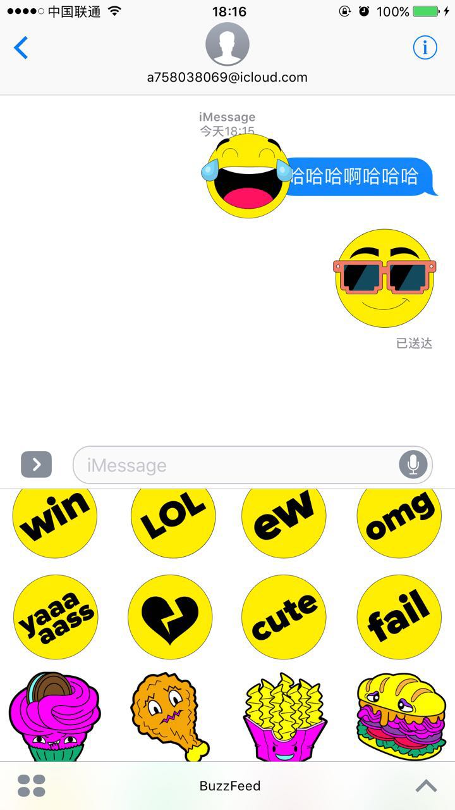
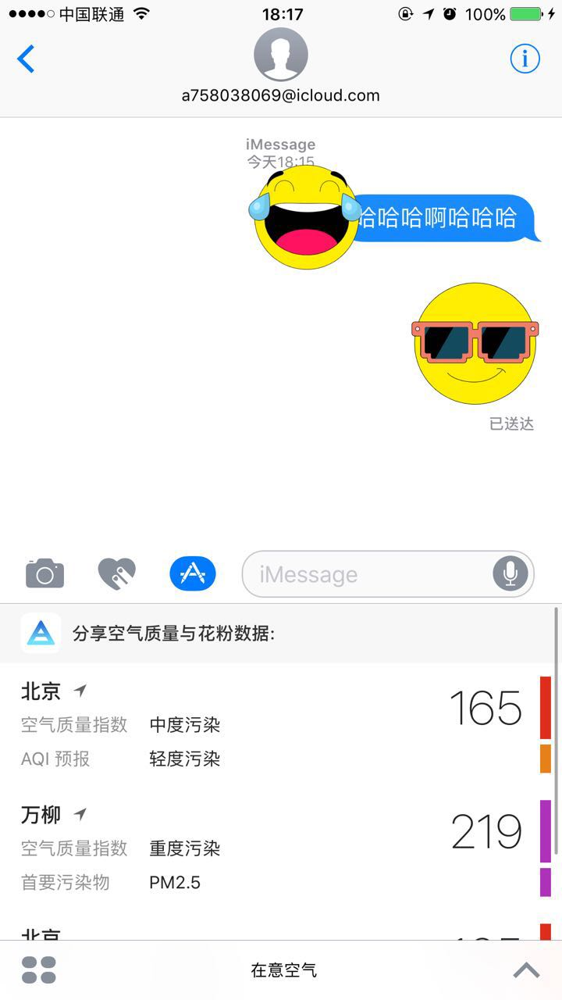
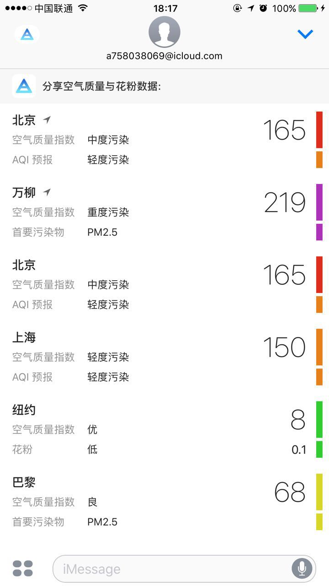
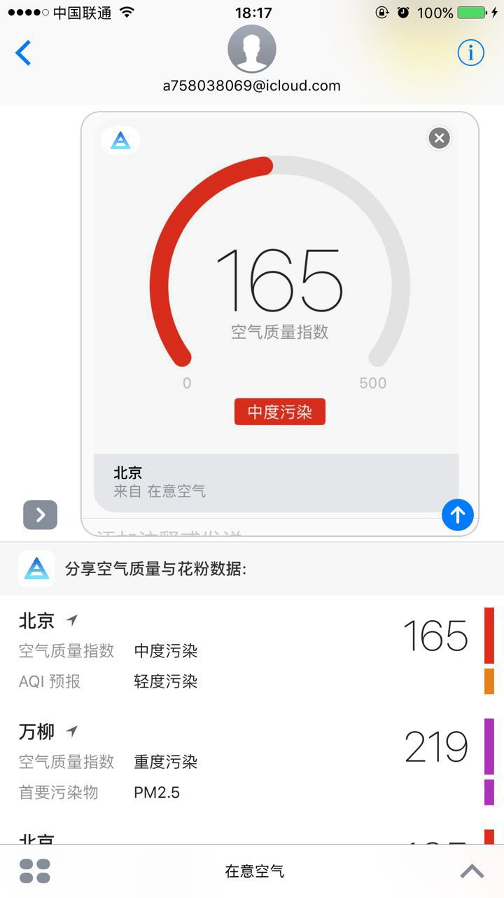
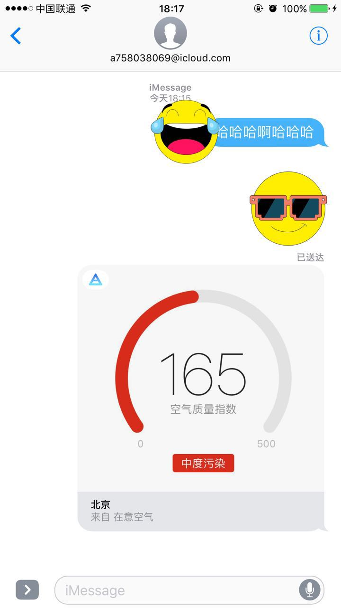
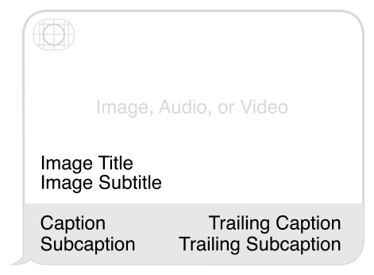
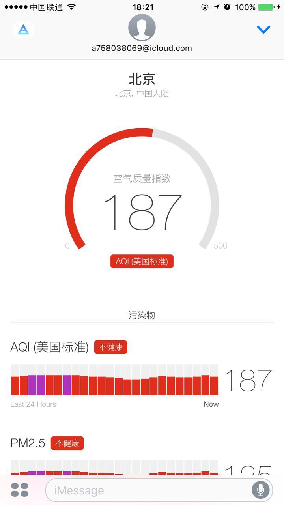

## iMessage Developer

- Stickers

- Interactive Messages

- 可以发送图片，音视频，文本，链接等等

### Messages App Store

iMessage App只能在iOS（10+）系统运行，iWatch和mac可以收到消息，但是不能解析。iWatch可以发送Stickers。

iMessage App本身是一个Extension，但是它可以独立开发，不依赖任何Container App。我们也可以在现有的项目中添加iMessage App，系统会自动将其添加到Messages App Store。

### 1. Stickers

就是表情包。

### 2. Interactive Messages

交互型消息(Interactive Messages)是一种特殊的消息类型，由图片、文字、音视频等组成，用户可以对该消息进行交互操作（由iMessage App定义）。

#### 2.1. 样式

这里用“在意空气” APP举例子

1.Compact样式。

2.Expanded样式。

3.编辑发送

4.发送出去的自定义消息

#### 2.2. 交互

**点击自定义消息**。如果没有app, 会弹出iMessage App Store 里面的相对应app下载页面。

如果有app, 分下面几种情况。

1.iMessage未启用该app，会打开iMessage app的管理应用页面，可以打开该app的iMessage功能。

2.直接在iMessage里弹出相应的详情页，如下：

**在这个详情页面可以只是单纯的展示详情信息，还可以对这条消息进行再编辑。**

3.弹起app，跳到相应页面。

