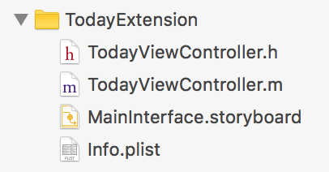
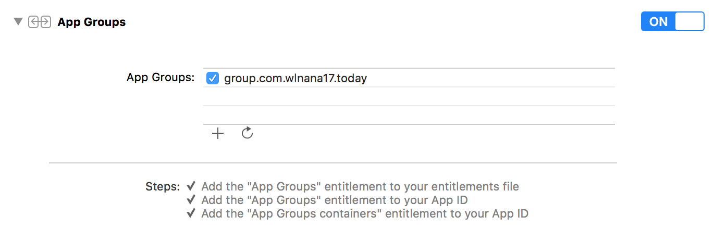
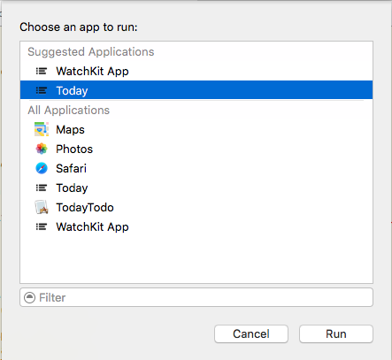
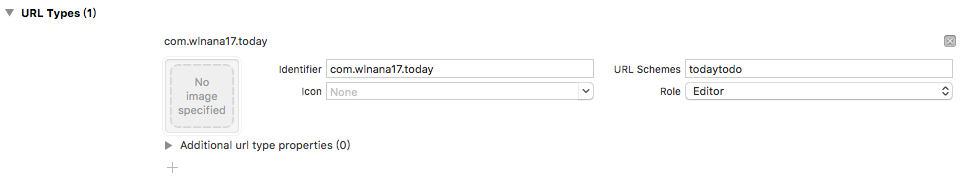
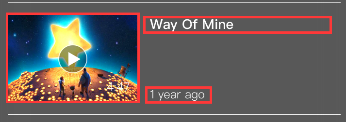

## iOS Extension 今日面板

从 iOS 8 开始，苹果引入了全新的 App Extension，涉及到方方面面，例如今日面板、键盘、内容拦截器、分享动作等。本篇文章主要创建一个今日面板应用，阐述一下几个问题:

- 创建今日面板插件，与主应用相互独立。
- 今日面板插件与主应用数据交互。
- 今日面板调起主程序并执行操作。
- 今日面板插件与主应用共用代码。

## 创建一个今日面板插件

为工程创建一个Today Extension : File -> New -> Target -> Application Extension -> Today Extension, 点击 Finish 就完成了 Today Extension的添加。 目录结构如下：



MainInterface.storyboard 里的 TodayViewController 即是插件的入口。真实的大小不能在 IB 里修改。

修改今日面板界面的大小，是通过修改 View Controller的 preferredContentSize 属性，不理会width，直接调整height到合适的大小即可，因为宽度总是和屏幕宽度相同的。


## 数据交互

App Extension 和主程序可以说没有什么关系，基本上就是两个独立的程序，你的主程序既不可以访问 App Extension 的代码，也不可以访问其存储空间，这完完全全就是两个进程、两个程序。

那么怎么才能让两者间的数据互通呢？

**可以用 App Group 来解决。** 

1.首先在主程序中创建一个 App Group: 在主程序 target 下的 Capabilities 栏目下打开 App Groups 开关，并增加一个group。



2.然后在 Today Extension 里添加这个 App Group 即可。这样，我们就可以用 NSUserDefaults 通过这个 App Group 交流数据了。

### 接下来我们实现一个将主程序中的前四条数据在今日面板中展示的功能。

1.在主程序中将数据存储在 App Group 里面。

```
- (void)updateTodaySnapshot
{
    NSUInteger count = MIN(self.dataArray.count, 4);
    NSArray <NSString *> *snapshot = [self.dataArray subarrayWithRange:NSMakeRange(self.dataArray.count - count, count)];
    
    NSUserDefaults *groupDefaults = [[NSUserDefaults alloc] initWithSuiteName:@"group.com.wlnana17.today"];
    [groupDefaults setObject:snapshot forKey:@"today-snapshot"];
    [groupDefaults synchronize];
}
```

2.Today Extension 的刷新时机

Today Extension 里面的 View Controller 遵守 NCWidgetProviding 协议。

```
- (void)widgetPerformUpdateWithCompletionHandler:(void (^)(NCUpdateResult))completionHandler {
    // Perform any setup necessary in order to update the view.
    
    // If an error is encountered, use NCUpdateResultFailed
    // If there's no update required, use NCUpdateResultNoData
    // If there's an update, use NCUpdateResultNewData
    
    completionHandler(NCUpdateResultNewData);
}

- (UIEdgeInsets)widgetMarginInsetsForProposedMarginInsets:(UIEdgeInsets)defaultMarginInsets
{
    return UIEdgeInsetsMake(15, 15, 15, 15);
}

```
第一个方法是告诉 Extension 需要更新了。

其中第二个方法是返回一个内补大小，如果不实现，默认情况视图左侧会有一定的缩进。

3.在 Today Extension 里面获取 App Group 里的数据。

```
- (void)loadContentsFromLocal
{
    NSUserDefaults *groupDefaults = [[NSUserDefaults alloc] initWithSuiteName:@"group.com.wlnana17.today"];
    self.dataArray = [groupDefaults objectForKey:@"today-snapshot"];
    
    if (self.dataArray.count) {
        [self showTableView];
    }else{
        [self showEmptyPlaceholder];
    }
}
```

获取数据，如果有数据则刷新 Table View，如果没有，则显示一个按钮。 这个获取数据刷新界面的方法可以放在 viewDidLoad 或者 widgetPerformUpdateWithCompletionHandler: 中调用都可以。

4.调试 Today Extension，选中 Today Extension 的 Scheme



## 今日面板调起主程序并执行操作。

由于插件访问不了主程序的代码， 所以用 URL Scheme 实现。



由于 App Extension 访问不了 UIApplication， 因此不能用它的 openURL:， 但是可以用 extensionContext 来打开 URL, 用法和效果是一样的。

```
- (void)addButtonAction:(UIButton *)button
{
    [self.extensionContext openURL:[NSURL URLWithString:@"todaytodo://new_item"] completionHandler:nil];
}
```
在主程序中处理 URL 的打开:

```
- (BOOL)application:(UIApplication *)app openURL:(NSURL *)url options:(NSDictionary<NSString *,id> *)options
{
    NSString *action = url.relativeString;
    if ([action hasPrefix:@"todaytodo://new_item"]) {
        //todo...
        
    }
    return YES;
}
```

**一个小提醒**

- 由于通知中心的界面是一大块 UIVisualEffectView ，并且具体参数调整过，所以插件的背景色最好保持透明，主要文字颜色最好是白色，次要文字的颜色最好是 lightTextColor，这样能适应毛玻璃下的 Vibrancy 效果。

- 当在通知中心使用 Table View Cell 时， 背景默认透明， 点击 Cell 透明部分无响应。 



如上图所示， Cell 的可以响应区域只有红色界面元素部分。 **透明的背景部分**无响应， 即使使用`didSelectRowAtIndexPath:` `UIGestureRecognizer` `touchesBegan:` 等方法， 也无响应。 若背景不透明则有响应。

解决方法： 在 Cell 内添加一个透明的 Label 充满全 Cell。

```
UILabel *fill = [[UILabel alloc] init];
[self.contentView addSubview:fill];
[fill mas_makeConstraints:^(MASConstraintMaker *make) {
    make.leading.mas_equalTo(weakSelf.contentView);
    make.trailing.mas_equalTo(weakSelf.contentView);
    make.top.mas_equalTo(weakSelf.contentView);
    make.bottom.mas_equalTo(weakSelf.contentView);
}];
```


## 共用代码


