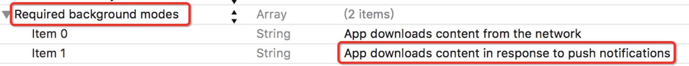
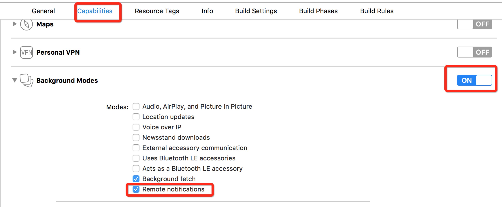
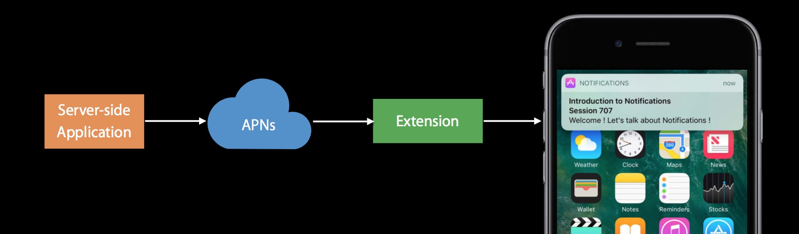

## iOS10 UserNotification

- [简介](#简介)
- [新框架](#新框架)
- [获取权限](#获取权限)
- [获取用户设置](#获取用户设置)
- [注册APNS，获取deviceToken](#注册APNS，获取deviceToken)
- [本地推送流程](#本地推送流程)
- [远程推送流程](#远程推送流程)
- [通知策略（Category+Action）](#通知策略（Category+Action）)
- [附件通知](#附件通知)
- [代理回调](#代理回调)

### 简介

iOS10新增了UserNotificationKit框架，整合了关于通知的方法。增加了很多新特性：

#### 1. 推送内容更加丰富

- 由之前的alert到现在的title、subtitle、body。
- 为推送增加了附近，包括符合格式和大小的图片、音频、视频。

#### 2. 方便的对推送的周期进行管理

- 更新推送
- 删除推送
- 查看推送

### 新框架

```
#import <UserNotifications/UserNotifications.h>
```

通过UNNotificationCenter来管理本地和远程通知，包括本地通知和远程通知。

### 获取权限

```
//iOS8以下
[application registerForRemoteNotificationTypes:UIRemoteNotificationTypeBadge | UIRemoteNotificationTypeAlert | UIRemoteNotificationTypeSound];

//iOS8 - iOS10
[application registerUserNotificationSettings:[UIUserNotificationSettings settingsForTypes:UIUserNotificationTypeAlert | UIUserNotificationTypeSound | UIUserNotificationTypeBadge categories:nil]];

//iOS10
UNUserNotificationCenter *center = [UNUserNotificationCenter currentNotificationCenter];
UNAuthorizationOptions options = UNAuthorizationOptionBadge | UNAuthorizationOptionSound | UNAuthorizationOptionAlert;
[center requestAuthorizationWithOptions:options completionHandler:^(BOOL granted, NSError * _Nullable error) {

}
```

### 获取用户设置

iOS10 提供了获取用户授权相关设置信息的接口getNotificationSettingsWithCompletionHandler： , 回调带有一个UNNotificationSettings对象，它具有以下属性，可以准确获取各种授权信息

```
authorizationStatus
soundSetting 
badgeSetting 
alertSetting 
notificationCenterSetting 
lockScreenSetting 
carPlaySetting
alertStyle
```

### 注册APNS，获取deviceToken

iOS10， 注册APNS和获取deviceToken的方法还和之前一样

```
[[UIApplication sharedApplication] registerForRemoteNotifications];
```

```
- (void)application:(UIApplication *)application didRegisterForRemoteNotificationsWithDeviceToken:(NSData *)deviceToken
{
}

- (void)application:(UIApplication *)application didFailToRegisterForRemoteNotificationsWithError:(NSError *)error
{
}
```

### 本地推送流程

1. 设置推送内容
2. 设置通知触发器
3. 添加通知
4. 管理通知

#### 1. 设置推送内容

```
attachments         //附件
badge               //数字标志
title               //推送内容标题
subtitle            //推送内容子标题
body                //推送内容body
categoryIdentifier  //category标识，操作策略
launchImageName     //点击通知进入应用的启动图
sound               //声音
userInfo 			 //附带通知内容
```

```
UNMutableNotificationContent *content = [[UNMutableNotificationContent alloc] init];
content.title = @"title";
content.subtitle = @"subtitle";
content.body = @"Copyright © 2016年 Hong. All rights reserved.";
content.sound = [UNNotificationSound soundNamed:@"test.caf"];
```

#### 2. 设置通知触发器

有4种触发器:

- UNPushNotificationTrigger 触发APNS服务，系统自动设置（这是区分本地通知和远程通知的标识）
- UNTimeIntervalNotificationTrigger 一段时间后触发
- UNCalendarNotificationTrigger 指定日期触发
- UNLocationNotificationTrigger 根据位置触发，支持进入某地或者离开某地或者都有

```
//5秒后触发
UNTimeIntervalNotificationTrigger *trigger = [UNTimeIntervalNotificationTrigger triggerWithTimeInterval:5 repeats:NO];

//每周三，13点触发
NSDateComponents *components = [[NSDateComponents alloc] init];
components.weekday = 4; //周三
components.hour = 13; //13点
UNCalendarNotificationTrigger *trigger = [UNCalendarNotificationTrigger triggerWithDateMatchingComponents:components repeats:YES];

//这个点，100米范围内，进入触发。
CLLocationCoordinate2D cen = CLLocationCoordinate2DMake(39.990465,116.333386);
CLRegion *region = [[CLCircularRegion alloc] initWithCenter:cen radius:100 identifier:@"center"];
region.notifyOnEntry = YES;
region.notifyOnExit = NO;
UNLocationNotificationTrigger *trigger = [UNLocationNotificationTrigger triggerWithRegion:region repeats:YES];
```
#### 3. 添加通知

需要先创建request，给request设置content和trigger，再添加到center。

```
UNNotificationRequest *request = [UNNotificationRequest requestWithIdentifier:@"request" content:content trigger:trigger];

[[UNUserNotificationCenter currentNotificationCenter] addNotificationRequest:request withCompletionHandler:^(NSError * _Nullable error) {
	NSLog(@"添加指定位置推送 ：%@", error ? [NSString stringWithFormat:@"error : %@", error] : @"success");
}];
```

#### 4. 管理通知

iOS10的推送都是通过center进行管理的。通过request的identifier，进行通知的查找、更新、删除。这个标识是用来区分这个通知和其他通知的。

- 更新：center 的 `addNotificationRequest:withCompletionHandler:` 方法在 id 不变的情况下重新添加，就可以刷新原有的推送。
- 删除：

```
removePendingNotificationRequestsWithIdentifiers:  //删除特定等待递送的通知
removeAllPendingNotificationRequests  //删除所有等待递送的通知
removeDeliveredNotificationsWithIdentifiers:  //删除特定已经递送的通知
removeAllDeliveredNotifications  //删除已经递送的通知
```
- 查找：

```
getPendingNotificationRequestsWithCompletionHandler:  //获取所有等待递送的通知
getDeliveredNotificationsWithCompletionHandler:  //获取所有已经递送的通知
```

### 远程推送流程

1. 注册推送，获取deviceToken
2. 使用普通推送
3. 使用后台推送
4. 使用静默推送
5. 管理通知

#### 1. 注册推送，获取deviceToken

在AppDelegate的application:didRegisterForRemoteNotificationsWithDeviceToken:里获取注册成功的deviceToken

#### 2. 使用普通推送 

```
//iOS10 之前
{
"aps" : {
    "alert" : "title",
    "badge" : 1,
    "sound":"default"
        },
}

//iOS10 新增的文案多样性
{
"aps" : {
    "alert" : { 
         "title" : "title", 
         "subtitle" : "subtitle",         
         "body" : "Copyright © 2016年 Hong. All rights reserved."
                },
    "badge" : 1,
    "sound":"default"
        },
}
```

#### 3. 使用后台推送

iOS7以后要想在后台做一些操作，需要在APNS增加字段："content-available":1。并且在Background Modes中增加Remote notifications。

```
{
     "aps":{
	     "alert":"Testing.. (34)",
		 "badge":1,
		 "sound":"default",
		 "content-available":1
		 }
}
```

要修改Background Modes， 可以修改info.plist中UIBackgroundModes字段， 或者在项目Target->Capabilities->Background Modes里面将Remote notifications选中。





后台推送的回调，会调用AppDelegate的application:didReceiveRemoteNotification:fetchCompletionHandler:方法

```
- (void)application:(UIApplication *)application didReceiveRemoteNotification:(NSDictionary *)userInfo fetchCompletionHandler:(void (^)(UIBackgroundFetchResult result))completionHandler
{
	[[DownloadManager sharedInstance] setCompletionBlock:^(BOOL finish, BOOL stop) {
        NSLog(@"completionblock");
        //后台处理完成
        completionHandler(UIBackgroundFetchResultNewData);
    }];
    [[DownloadManager sharedInstance] start];
}
```
如果不打开Background Modes里面将Remote notifications，或者apsn里面不增加字段："content-available":1，app在后台收到推送，将不会调用上面的方法。

更多后台处理可以看[iOS后台下载](ios_background_download.md)

#### 4. 使用静默推送

APNS去掉alert、badge、sound字段实现静默推送，增加增加字段："content-available":1，也可以在后台做一些事情。

```
{
     "aps":{
		 "content-available":1
		 }
}
```

#### 5. 管理通知

通过新的字段 apns-collapse-id

### 通知策略（Category+Action）

action：设置标识（identifier）、按钮标题（title）、按钮选项（options）

```
+ (instancetype)actionWithIdentifier:(NSString *)identifier title:(NSString *)title options:(UNNotificationActionOptions)options;
```

```
options:
UNNotificationActionOptionAuthenticationRequired  执行前需要解锁确认
UNNotificationActionOptionDestructive  显示高亮（红色）
UNNotificationActionOptionForeground  将会引起程序启动到前台
```

action 有2种类型：

- UNNotificationAction 普通按钮样式
- UNTextInputNotificationAction 输入框样式

category：设置标识（identifier）、actions、intentIdentifiers（需要填写你想要添加到哪个推送消息的 id）、策略选项（options）

```
+ (instancetype)categoryWithIdentifier:(NSString *)identifier actions:(NSArray<UNNotificationAction *> *)actions intentIdentifiers:(NSArray<NSString *> *)intentIdentifiers options:(UNNotificationCategoryOptions)options;
```

```
options
UNNotificationCategoryOptionNone
UNNotificationCategoryOptionCustomDismissAction  当清除当前通知时，会走center的delegate。
UNNotificationCategoryOptionAllowInCarPlay  适用于行车模式
```

具体使用

```
UNNotificationAction *action1 = [UNNotificationAction actionWithIdentifier:@"action1" title:@"需要解锁" options:UNNotificationActionOptionAuthenticationRequired];
UNNotificationAction *action2 = [UNNotificationAction actionWithIdentifier:@"action2" title:@"启动app" options:UNNotificationActionOptionForeground];
//给category设置action
UNNotificationCategory *category1 = [UNNotificationCategory categoryWithIdentifier:@"category1" actions:@[action1, action2] intentIdentifiers:@[] options:UNNotificationCategoryOptionNone];
//给通知内容设置category
content.categoryIdentifier = @"category1";
```

### 附件通知

1. 本地推送通知增加附件，只需给content.attachments设置UNNotificationAttachment附件对象
2. 远程推送通知增加附件，需要实现 UNNotificationServiceExtension（通知服务扩展），在回调方法中处理 推送内容时设置 request.content.attachments（请求内容的附件） 属性，之后调用 contentHandler 方法即可。

给本地推送通知增加附件

```
NSString *path = [[NSBundle mainBundle] pathForResource:@"IMG_0723" ofType:@"mp4"];
UNNotificationAttachment *attachment = [UNNotificationAttachment attachmentWithIdentifier:@"atta1" URL:[NSURL fileURLWithPath:path] options:nil error:&error];

content.attachments = @[attachment];
```

### 代理回调

#### 1. UNUserNotificationCenterDelegate

**通知将要显示的回调方法**：应用在前台，收到通知时触发。

```
- (void)userNotificationCenter:(UNUserNotificationCenter *)center willPresentNotification:(UNNotification *)notification withCompletionHandler:(void (^)(UNNotificationPresentationOptions options))completionHandler
{
	//如果需要在应用在前台也展示通知
    completionHandler(UNNotificationPresentationOptionSound | UNNotificationPresentationOptionAlert);
}
```
**操作的回调方法**：不管应用在前台、后台还是被手动划掉，下面三种情况将触发该方法：

1. 点击通知进入应用
2. 点击action
3. 清除了category是UNNotificationCategoryOptionCustomDismissAction的通知。

```
- (void)userNotificationCenter:(UNUserNotificationCenter *)center didReceiveNotificationResponse:(UNNotificationResponse *)response withCompletionHandler:(void(^)())completionHandler
{
    completionHandler();
}
```

#### 2. UIApplicationDelegate

**收到远程推送的回调方法**：APNS带有"content-available":1字段，并且应用在前台或者后台时收到远程推送，将触发该方法。（注意：应用被手动划掉将无法触发）

可以在这个方法里做一些后台操作（下载数据，更新UI等），记得修改Background Modes。

```
- (void)application:(UIApplication *)application didReceiveRemoteNotification:(NSDictionary *)userInfo fetchCompletionHandler:(void (^)(UIBackgroundFetchResult result))completionHandler
{
	completionHandler(UIBackgroundFetchResultNewData);
}

```

**问题**: 应用在后台，收到本地通知的回调方法暂时未知。


### UNNotificationContentExtension - 通知内容扩展

通知内容扩展需要新建一个 UNNotificationContentExtension Target，之后只需在 viewcontroller 的中实现相应的接口，即可以对 app 的通知页面进行自定义扩展，扩展主要用于自定义 UI。


###  UNNotificationServiceExtension - 通知服务扩展



UNNotificationServiceExtension 提供在远程推送将要被 push 出来前，处理推送显示内容的机会。此时可以对通知的 request.content 进行内容添加，如添加附件，userInfo 等。

通过远程推送的通知也支持 UNNotificationContentExtension，只需将 content.categoryIdentifier （通知内容类型标示） 的值设置为已经添加到 UNNotificationContentExtension plist 中的值即可。

使用UNNotificationServiceExtension，你有30秒的时间处理这个通知，可以同步下载图像和视频到本地，然后包装为一个UNNotificationAttachment扔给通知，这样就能展示用服务器获取的图像或者视频了。这里需要注意：如果数据处理失败，超时，extension会报一个崩溃信息，但是通知会用默认的形式展示出来，app不会崩溃。

### 结束语

本文是根据iOS10推送通知的新框架， 将本地、远程推送的完整流程写了一遍。对于UNNotificationContentExtension（通知内容扩展）和 UNNotificationServiceExtension（通知服务扩展）这两块，将会另起篇幅详细描述。

更多代码实现请查看[Demo](https://github.com/liuyanhongwl/UserNotification)， 如发现问题，请帮忙指正。

如果想了解iOS10之前的推送，[点击这里](ios-local-remote-notification.md)

如果想了解更多有关后台下载的知识， [点击这里](ios_background_download.md)

#### 参考

- [玩转 iOS 10 推送 —— UserNotifications Framework](http://www.jianshu.com/p/2f3202b5e758)
- [iOS10 关于推送](http://blog.csdn.net/yydev/article/details/52105830)
- [iOS 10 推送的简单使用](http://www.cnblogs.com/MasterPeng/p/5909752.html)
- [iOS10 User Notifications 学习笔记](http://maquannene.github.io/2016/06/27/iOS10%20UserNotifications%20%E5%AD%A6%E4%B9%A0%E7%AC%94%E8%AE%B0/#3-UNNotificationContentExtension-通知内容扩展)
- [【WWDC2016 Session】iOS 10 推送Notification新特性](http://www.cocoachina.com/ios/20160628/16833.html)