## iOS10推送通知进阶(Notification Extension）

- [简介](#简介)
- [UNNotificationServiceExtension - 通知服务扩展](#UNNotificationServiceExtension-通知服务扩展)
- [UNNotificationContentExtension - 通知内容扩展](#UNNotificationContentExtension-通知内容扩展)

<h2 id="简介"></h2>
### 简介

这篇文章主要讲iOS10推送通知的两个扩展框架：**UNNotificationServiceExtension（通知服务扩展）** 和 **UNNotificationContentExtension（通知内容扩展）**。

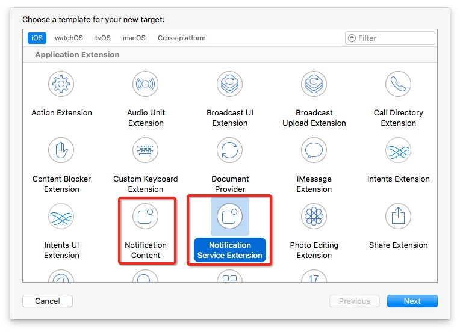

- UNNotificationServiceExtension（通知服务扩展）是在收到通知后，展示通知前，做一些事情的。比如，增加附件，网络请求等。
- 想要给通知创建一个自定义的用户界面，需要 UNNotificationContentExtension（通知内容扩展）。


### UNNotificationServiceExtension-通知服务扩展

如果经常使用iMessage的朋友们，就会经常收到一些信息，附带了一些照片或者视频，所以推送中能附带这些多媒体是非常重要的。如果推送中包含了这些多媒体信息，可以使用户不用打开app，不用下载就可以快速浏览到内容。众所周知，推送通知中带了push payload，即使z去年苹果已经把payload的size提升到了4k bites，但是这么小的容量也无法使用户能发送一张高清的图片，甚至把这张图的缩略图包含在推送通知里面，也不一定放的下去。在iOS X中，我们可以使用新特性来解决这个问题。我们可以通过新的service extensions来解决这个问题。

iOS10给通知添加附件有两种情况：本地通知和远程通知。

1. 本地推送通知，只需给content.attachments设置UNNotificationAttachment附件对象
2. 远程推送通知，需要实现 UNNotificationServiceExtension（通知服务扩展），在回调方法中处理 推送内容时设置 request.content.attachments（请求内容的附件） 属性，之后调用 contentHandler 方法即可。

UNNotificationServiceExtension 提供在远程推送将要被 push 出来前，处理推送显示内容的机会。此时可以对通知的 request.content 进行内容添加，如添加附件，userInfo 等。下图显示了Notification Service Extension的流程：

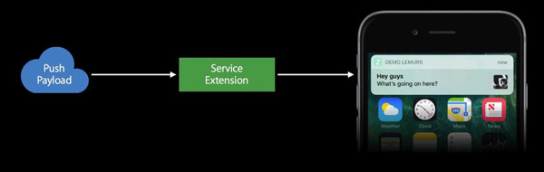

处理的细节如下：

1.为了能在service extension 里面的attachment，必须给apns增加 "mutable-content":1 字段，使你的推送通知是动态可变的。

```
{
     "aps":{
     	 "alert":"Testing.. (34)",
	     "badge":1,
    	 "sound":"default",
	     "mutable-content":1
	  }
}
```

2.给项目新建一个Notification Service Extension的扩展。

3.在-didReceiveNotificationRequest:withContentHandler:方法中处理request.content，用来给通知的内容做修改。如面代码示例了收到通知后，给通知增加图片附件：

```
- (void)didReceiveNotificationRequest:(UNNotificationRequest *)request withContentHandler:(void (^)(UNNotificationContent * _Nonnull))contentHandler {
    self.contentHandler = contentHandler;
    self.bestAttemptContent = [request.content mutableCopy];
    self.bestAttemptContent.title = [NSString stringWithFormat:@"%@ [modified]", self.bestAttemptContent.title];
    
    //1. 下载
    NSURL *url = [NSURL URLWithString:@"http://img1.gtimg.com/sports/pics/hv1/194/44/2136/138904814.jpg"];
    NSURLSessionConfiguration *config = [NSURLSessionConfiguration defaultSessionConfiguration];
    NSURLSession *session = [NSURLSession sessionWithConfiguration:config];
    NSURLSessionDataTask *task = [session dataTaskWithURL:url completionHandler:^(NSData * _Nullable data, NSURLResponse * _Nullable response, NSError * _Nullable error) {
        if (!error) {
        
            //2. 保存数据
            NSString *path = [NSSearchPathForDirectoriesInDomains(NSLibraryDirectory, NSUserDomainMask, YES).firstObject
                              stringByAppendingPathComponent:@"download/image.jpg"];
            UIImage *image = [UIImage imageWithData:data];
            NSError *err = nil;
            [UIImageJPEGRepresentation(image, 1) writeToFile:path options:NSAtomicWrite error:&err];
            
            //3. 添加附件
            UNNotificationAttachment *attachment = [UNNotificationAttachment attachmentWithIdentifier:@"remote-atta1" URL:[NSURL fileURLWithPath:path] options:nil error:&err];
            if (attachment) {
                self.bestAttemptContent.attachments = @[attachment];
            }
        }
        
        //4. 返回新的通知内容
        self.contentHandler(self.bestAttemptContent);
    }];
    
    [task resume];
}
```

**注意：**使用UNNotificationServiceExtension，你有30秒的时间处理这个通知，可以同步下载图像和视频到本地，然后包装为一个UNNotificationAttachment扔给通知，这样就能展示用服务器获取的图像或者视频了。这里需要注意：如果数据处理失败，超时，extension会报一个崩溃信息，但是通知会用默认的形式展示出来，app不会崩溃。

附件通知所带的附件格式大小都是有限的，并不能做所有事情，视频的前几帧作为一个通知的附件是个不错的选择。

### UNNotificationContentExtension-通知内容扩展

要想创建一个自定义的用户界面，需要用到Notification Content Extension（通知内容扩展）。

Notification Content Extension（通知内容扩展）允许开发者加入自定义的界面，在这个界面里面，你可以绘制任何你想要的东西。但是有一个最重要的限制就是，**这个自定义的界面没有交互**。它们不能接受点击事件，用户并不能点击它们。但是推送通知还是可以继续与用户进行交互，因为用户可以使用notificaiton的actions。**注意：extension也可以处理这些actions**。

#### 1. 推送界面的组成

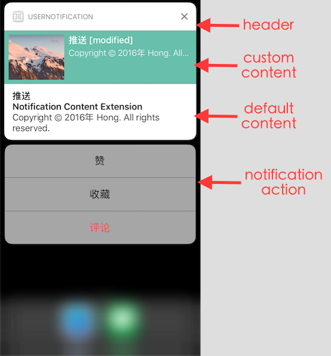

- header的UI是系统提供的一套标准的UI。这套UI会提供给所有的推送通知。
- header下面的custom content是自定义的内容，就是Notification Content Extension（通知内容扩展）。在这里，就可以显示任何你想绘制的内容了。你可以展示任何额外的有用的信息给用户。
- default content是系统的界面。这也就是iOS 9 之前的推送的样子。
- 最下面的notification action，在这一段，用户可以触发一些操作。并且这些操作还会相应的反映到上面的自定义的推送界面content extension中。

#### 2. 创建Notification Content Extension

创建一个新的Notification Content的target。Xcode自动生成一个新的模板，下面有三个文件，ViewController、main Interface storyboard、info.plist。

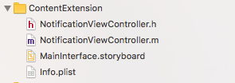

然后打开这里的ViewController。

```
#import "NotificationViewController.h"
#import <UserNotifications/UserNotifications.h>
#import <UserNotificationsUI/UserNotificationsUI.h>

@interface NotificationViewController () <UNNotificationContentExtension>

@property IBOutlet UILabel *label;

@end

@implementation NotificationViewController

- (void)viewDidLoad {
    [super viewDidLoad];
    // Do any required interface initialization here.
}

- (void)didReceiveNotification:(UNNotification *)notification {
    self.label.text = notification.request.content.body;
}

@end
```

发现这里的ViewController就是一个普通的UIViewController, 但是它实现了UNNotificationContentExtension协议。

UNNotificationContentExtension协议有一个required方法didReceiveNotification:。当收到**指定categroy**的推送时， didReceiveNotification:方法会随着ViewController的生命周期方法，一起被调用，这样就能接受notification object，更新UI。

#### 3. 配置category

接下来就是要让推送到达后，系统怎样找到自定义的UI。这时候就需要配置extension的info.plist文件。

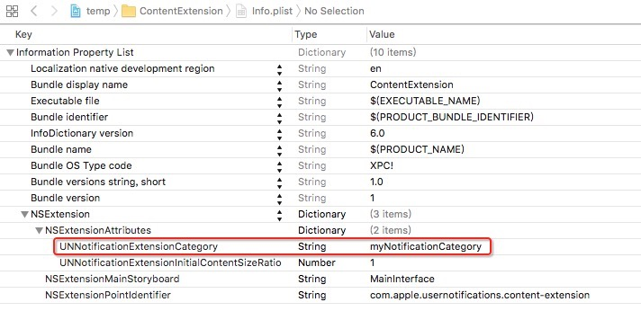

这里和我们给notification actions注册category一样，给这个通知扩展指定相应的category。在UNNotificationExtensionCategory字段里写入相应的category id。值得提到的一点是，这里对应的category是可以为一个数组的，里面可以为多个category，这样做的目的是多个category共用同一套UI。

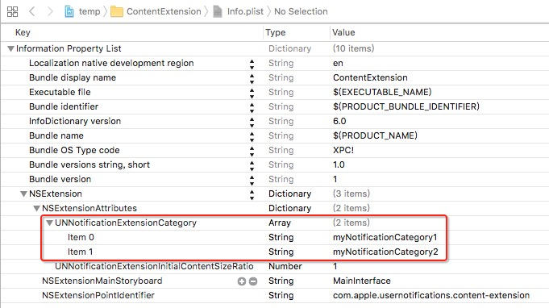

上图中category id为myNotificationCategory1和myNotificationCategory2的通知就共用了一套UI。

设置了category后， 只要在通知里面增加category字段，值是上面在extension的plist里面配置的category id， 收到的通知就会通过自定义的样式显示。

远程通知在apns里面增加category字段。

```
{
    "aps":{
        "alert":"Testing.. (34)",
     	"badge":1,
	   	"sound":"default",
    	"category":"myNotificationCategory1"
     }
}
```


#### 4. 自定义UI

然后开始写自定义UI。

```
- (void)didReceiveNotification:(UNNotification *)notification {
    self.label.text = [NSString stringWithFormat:@"%@ [modified]", notification.request.content.title];
    self.subLabel.text = [NSString stringWithFormat:@"%@ [modified]", notification.request.content.body];
    self.imageView.image = [UIImage imageNamed:@"hong.png"];
}
```

可以在ViewController中增加一些Label和ImageView，收到通知的时候，提取想要的内容，或者添加额外的内容，设置到我们自定义的View上。

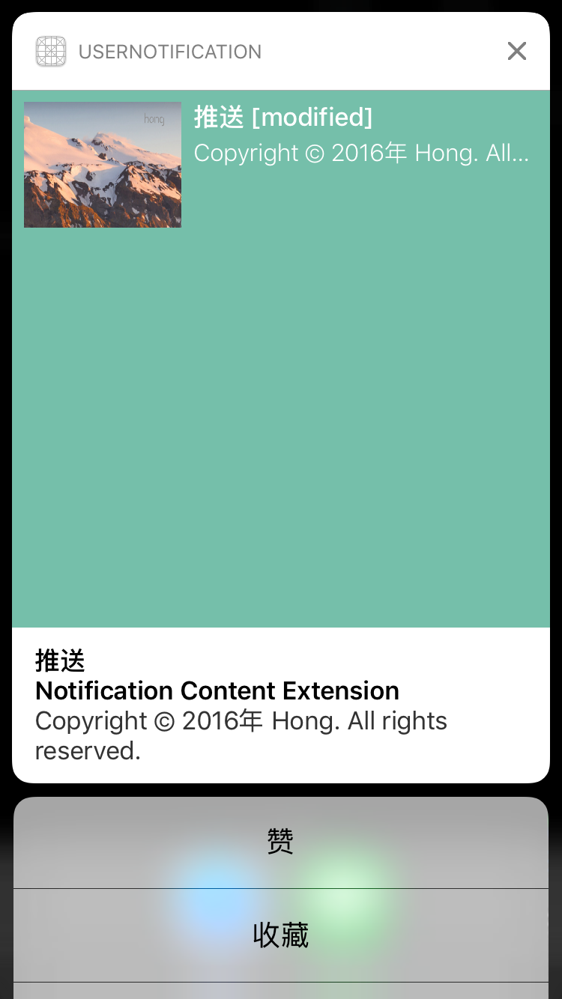

#### 5. 优化

优化一：发现是自定义界面的大小很不美观

1. 这时候可以通过设置ViewController的preferredContentSize大小，控制自定义视图的大小。
2. 也可以通过约束，控制自定义视图的大小。

```
- (void)viewDidLoad {
    [super viewDidLoad];
    self.preferredContentSize = CGSizeMake(CGRectGetWidth(self.view.frame), 100);
}
```

优化二：目标大小的问题解决了，但是发现视图恢复成正确的尺寸前，先展示有一大片空白的样子，然后变成正确的样子。当通知展示出来之后，它的大小并不是正常的我们想要的尺寸。iOS系统会去做一个动画来Resize它的大小。这样体验很差。

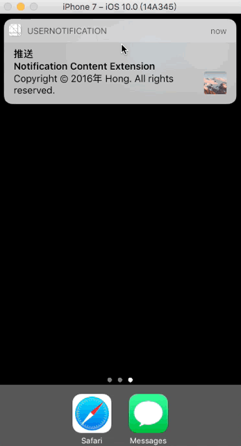

会出现上面这张图的原因是，在推送送达的那一刻，iOS系统需要知道我们推送界面的最终大小。但是我们自定义的extension在系统打算展示推送通知的那一刻，并还没有启动。所以这个时候，在我们代码都还没有跑起来之前，我们需要告诉iOS系统，我们的View最终要展示的大小。

为了解决这个问题，我们需要在extension的info.plist里设置一个content size ratio。增加字段UNNotificationExtensionInitialContentSizeRatio。

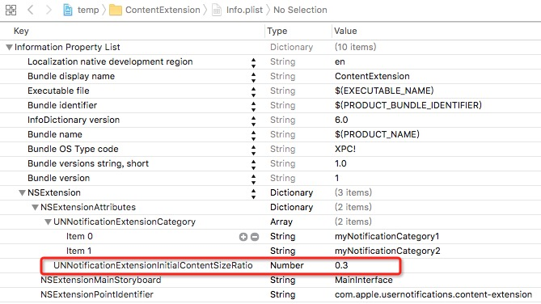

这个属性定义了宽和高的比例。当然设置了这个比例以后，也并不是万能的。因为你并不知道你会接受到多长的content。当你仅仅只设置比例，还是不能完整的展示所有的内容。有些时候如果我们可以知道最终的尺寸，那么我们固定尺寸会更好。

优化三：这时候我们发现我们自定义的界面显示的内容(custom content)和系统默认的内容(default content)重复了。

可以在extension的info.plist里设置，把系统默认的样式隐藏。增加字段UNNotificationExtensionDefaultContentHidden。

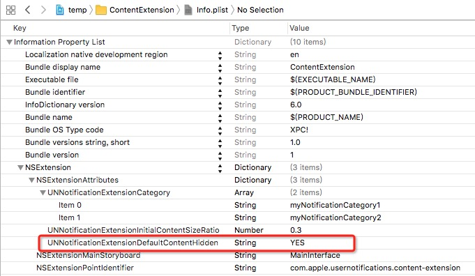

将系统内容隐藏后效果如下：

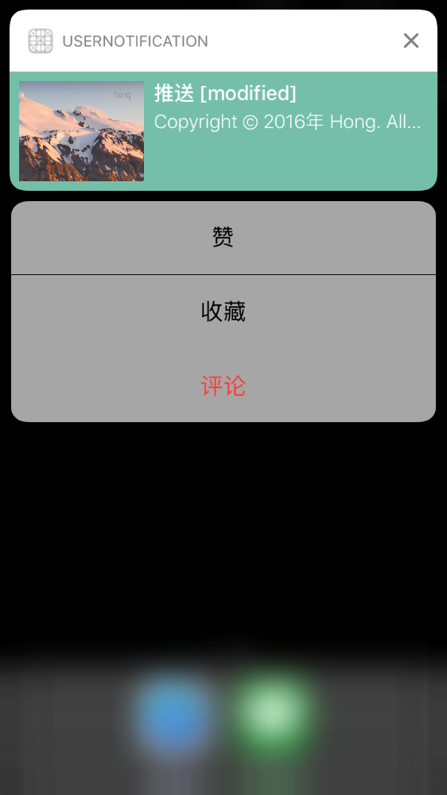


#### 6. 自定义操作

iOS8开始引入的action的工作原理：

默认系统的Action的处理是，当用户点击的按钮，就把action传递给app，与此同时，推送通知会立即消失。这种做法很方便。

但是有的情况是，希望用户点击action按钮后，效果及时响应在我们自定义的UI上。这个时候，用户点击完按钮，我们把这个action直接传递给extension，而不是传递给app。当actions传递给extension时，它可以延迟推送通知的消失时间。在这段延迟的时间之内，我们就可以处理用户点击按钮的事件了，并且更新UI，一切都处理完成之后，我们再去让推送通知消失掉。

这里我们可以运用UNNotificationContentExtension协议的第二个方法，这方法是Optional

```
- (void)didReceiveNotificationResponse:(UNNotificationResponse *)response completionHandler:(void (^)(UNNotificationContentExtensionResponseOption option))completion
{
    if ([response.actionIdentifier isEqualToString:@"action-like"]) {
        self.label.text = @"点赞成功~";
    }else if ([response.actionIdentifier isEqualToString:@"action-collect"]){
        self.label.text = @"收藏成功~";        
    }else if ([response.actionIdentifier isEqualToString:@"action-comment"]){
        self.label.text = [(UNTextInputNotificationResponse *)response userText];
    }
    
    //这里如果点击的action类型为UNNotificationActionOptionForeground，
    //则即使completion设置成Dismiss的，通知也不能消失
    
    dispatch_after(dispatch_time(DISPATCH_TIME_NOW, (int64_t)(1.5 * NSEC_PER_SEC)), dispatch_get_main_queue(), ^{
        completion(UNNotificationContentExtensionResponseOptionDismiss);
    });
}
```

在这个方法里判断所有的action，更新界面，并延迟1.5秒后让通知消失。真实情况可能是，点击“赞”按钮后，发送请求给服务器，根据服务器返回结果，展示不同的UI效果在通知界面上，然后消失。如果是评论，则将评论内容更新到界面上。

如果还想把这个action传递给app，最后消失的参数应该这样：

```
completion(UNNotificationContentExtensionResponseOptionDismissAndForwardAction);
```

但是我实际运行遇见这种情况，如果点击的action类型为UNNotificationActionOptionForeground，则即使completion设置成Dismiss的，通知也不能消失，也没有启动app，这里不太明白为什么会这样，如果有知道原因的，欢迎大家评论。

#### 7.自定义输入型操作

action 有2种类型：

- UNNotificationAction 普通按钮样式
- UNTextInputNotificationAction 输入框样式

UNTextInputNotificationAction的样式如下：

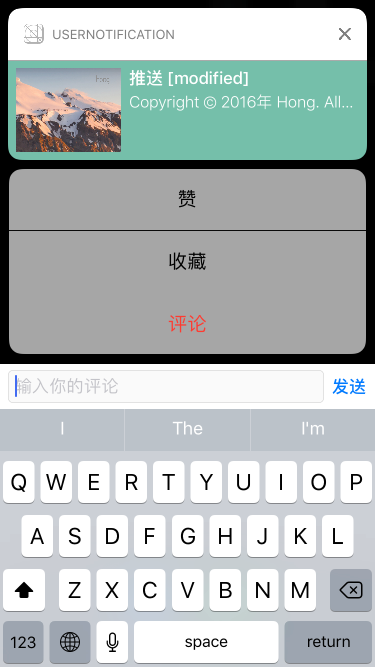

系统的输入样式的action，只有在点击发送按钮时，才能接受到action的响应回调。（比如上面的didReceiveNotificationResponse:completionHandler:方法）。但有的时候系统的样式或者功能不能满足需求，这时候可以自定义键盘上面的inputAccessoryView。

首先，重写ViewController的下面两个方法：

```
- (BOOL)canBecomeFirstResponder
{
    return YES;
}

- (UIView *)inputAccessoryView
{
    return self.customInputView;
}

```
自定义inputAccessoryView，以绘制自定义的输入样式。

```
- (void)didReceiveNotificationResponse:(UNNotificationResponse *)response completionHandler:(void (^)(UNNotificationContentExtensionResponseOption option))completion
{
	...
	
    }else if ([response.actionIdentifier isEqualToString:@"action-comment"]){
        self.label.text = [(UNTextInputNotificationResponse *)response userText];
        [self becomeFirstResponder];
        [self.textField becomeFirstResponder];
        
        self.completion = completion;
    }
}
```

实现了点击评论按钮，ViewController 成为第一响应者，使自定义的输入样式显示出来。然后，让textField成为第一响应者，使键盘弹出。

这里将操作的completion保存，以便在需要的时候调用。比如，可以在点击键盘右下的send按钮时，调用completion，使通知消失。

```
- (BOOL)textFieldShouldReturn:(UITextField *)textField
{
    [textField resignFirstResponder];
    self.label.text = textField.text;
    dispatch_after(dispatch_time(DISPATCH_TIME_NOW, (int64_t)(1.5 * NSEC_PER_SEC)), dispatch_get_main_queue(), ^{
        self.completion(UNNotificationContentExtensionResponseOptionDismiss);
    });
    return YES;
}
```

实现效果入下：

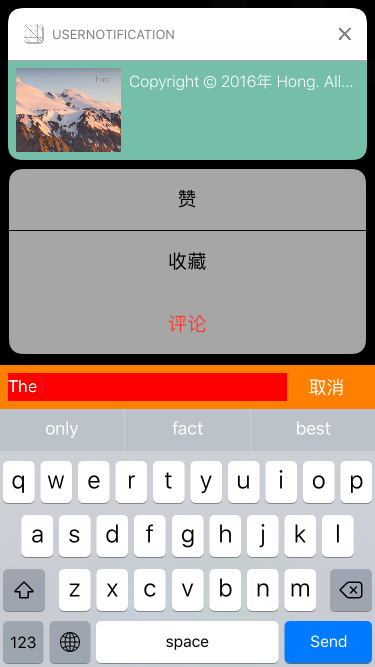


### 结合使用两个扩展

可以在content extension里面绘制界面时，通过notification.request.content.attachments获取附件放到自定义控件里面。

```
- (void)didReceiveNotification:(UNNotification *)notification {

	...
    
    UNNotificationAttachment *attachment = notification.request.content.attachments.firstObject;
    if (attachment) {
        if ([attachment.URL startAccessingSecurityScopedResource]) {
            self.imageView.image = [UIImage imageWithContentsOfFile:attachment.URL.path];
            dispatch_after(dispatch_time(DISPATCH_TIME_NOW, (int64_t)(0.5 * NSEC_PER_SEC)), dispatch_get_main_queue(), ^{
                [attachment.URL stopAccessingSecurityScopedResource];
            });
        }
    }
}
```

我们可以提取content的attachments。前文提到过，attachment是由系统管理的，系统会把它们单独的管理，这意味着它们存储在我们sandbox之外。所以这里我们要使用attachment之前，我们需要告诉iOS系统，我们需要使用它，并且在使用完毕之后告诉系统我们使用完毕了。对应上述代码就是-startAccessingSecurityScopedResource和-stopAccessingSecurityScopedResource的操作。当我们获取到了attachment的使用权之后，我们就可以使用那个文件获取我们想要的信息了。

#### 参考

- [iOS10 User Notifications 学习笔记](http://maquannene.github.io/2016/06/27/iOS10%20UserNotifications%20%E5%AD%A6%E4%B9%A0%E7%AC%94%E8%AE%B0/#3-UNNotificationContentExtension-通知内容扩展)
- [【WWDC2016 Session】iOS 10 推送Notification新特性](http://www.cocoachina.com/ios/20160628/16833.html)
