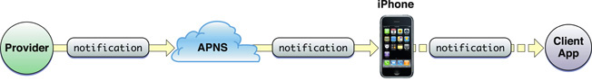

##一步一步实现iOS应用PUSH功能    

### 1. push原理

iOS push 工作机制可以用下图简要概括

 - `Provider`:应用自己的服务器；
 - `APNS`:Apple Push Notification Service的简称，苹果的PUSH服务器；
 
 
 
##### push的主要工作流程是：

 - iOS设备连接网络后，会自动与APNS保持类似TCP的长链接，等待APNS推送消息的到来；
 - 应用启动时注册消息推送，并获取设备的在APNS中注册的唯一设备标示deviceToken上传给应用服务器(即Provider)；
 - 在需要给应用推送消息时，Provider把push内容、接收push消息的deviceToken按APNS指定的格式打包好，发送给APNS；
 - APNS收到Provider发送的消息后，查找deviceToken指定的设备，如果该设备已经和APNS建立了连接，则立即将消息推送给该设备，如果设备不在线，则在该设备下次连接到APNS后将消息推送到设备。请注意苹果并不保证推送一定成功；
 - 设备收到push消息后，iOS系统会根据SSL证书判断这个push消息是发给那个应用的，进而启动相应客户端。
 
 
 <pre><code>上述过程中，有两个关键步骤需要自己处理的是：1.客户端获取deviceToken，并上传到Provider；2.Provider发送push消息到APNS。这两个步骤中都需要苹果的push证书授权，下面就来介绍如何生成push证书，以及Provisioning Profile。</code></pre>

### 2. push证书及Provisioning Profile生成

 - ##### 用付费帐号登录到http://developer.apple.com/iphone/index.action

 - ##### 生成push证书前要先生成开发证书

	生成开发证书的过程不详细介绍，可以参考[如何联机调试和发布程序](http://www.cocoachina.com/bbs/read.php?tid=7923&keyword=%B7%A2%B2%BC)。只是有一点需要注意的，生成开发证书过程中需要通过Keychain生成一个CSR文件，默认名为CertificateSigningRequest.certSigningRequest，这个文件将在生成push证书的时候用到。 

 - ##### 创建一个App ID
 创建过程中Description可以任意填写，比如叫`push_demo`；
Bundle Identifier一般用`com.company.appname`这样的格式，例如`com.mycompany.demo`；
注意：要用push功能的Bundle Identifier一定不能出现通配符，比如`com.mycompany.*`，这样的名字是不能使用push的。

 - ##### 生成Push SSL Certificate
 
 	生成好App ID后点击`Configure`进入配置页。打开`Enable for Apple Push Notification service`选项，该选项下有`Development Push SSL Certificate`和`Production Push SSL Certificate`两个SSL Certificate可以配置，前面一个是用来的开发的push证书，后面一个是用来发布的。我们以开发push证书为例，点击`Development Push SSL Certificate`->`Configure`，后面会要求选择CSR文件，这就是生成开发证书时的CertificateSigningRequest.certSigningRequest文件，选择好CSR后就生成好相应的SSL Certificate了。下载下来，保存名为`aps_developer.cer`。

 - ##### 从Keychain中导出私钥、设置好密码，命名为private_key.p12

 - ##### 生成push证书

 - - ** 这时我们一共得到3个文件: **

> 1. CertificateSigningRequest.certSigningRequest
> 2. private_key.p12
> 3. aps_developer.cer

 - - ** 将aps_developer.cer转成pem格式 ** 
 
 <pre><code> openssl x509 -in aps_developer.cer -inform DER -out aps_developer.pem -outform PEM </code></pre>

 - - ** 将private_key.p12格式的私钥转换成private_key.pem **

 <pre><code> openssl pkcs12 -nocerts -out private_key.pem -in private_key.p12
</code></pre>
 
 > 这一步会要求输入p12私钥的密码，以及设置新生成的pem的密码。

 - - ** 创建用于服务端的SSL p12格式证书，命名为aps_developer.p12 **

 <pre><code>openssl pkcs12 -export -in aps_developer.pem -inkey private_key.pem -certfile CertificateSigningRequest.certSigningRequest -name "aps_developer" -out aps_developer.p12
</code></pre>

 > 这一步会要求输入private_key.pem的密码，注意不是private_key.p12的密码。如果密码错误，或者CertificateSigningRequest.certSigningRequest文件不匹配都不能正常生成aps_developer.p12文件，如果生成的aps_developer.p12文件大小是0，说明生成过程中出了问题，请检查pem私钥、密码、以及CertificateSigningRequest.certSigningRequest是否正确。

aps_developer.p12就是Provider向APNS发送push消息需要的SSL证书。把这个证书和密码提供给服务端，服务端就可以发送push消息给APNS了。这时服务端已经可以工作了，但客户端还必须配置相应的Provisioning Profile才能启动应用的push功能。

 > 服务器配置需注意的是，由于我们生成的是开发环境的push证书，所以服务器应该连接APNS的sandbox环境地址：`gateway.sandbox.push.apple.com:2195`，如果应用正式发布，就要连接正式环境，必须生成相应的发布证书，并连接APNS正式环境地址：`gateway.push.apple.com:2195`。

