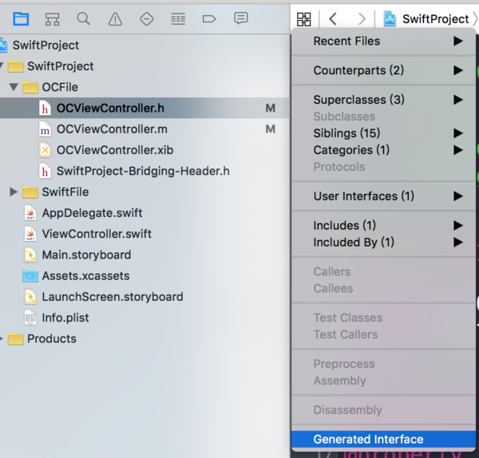

## 项目中同时有objective-c 和swift

### Mix and Match 

Swift 与 Objective-C 的兼容能力使你可以在同一个工程中同时使用两种语言。你可以用这种叫做 `mix and match` 的特性来开发基于混合语言的应用，可以用 Swfit 的最新特性实现应用的一部分功能，并无缝地并入已有的 Objective-C 的代码中。

### 在objective-c项目中接入 swift

Xcode会自动为Project生成头文件以便在Objective-C中调用。
在Objective-C类中调用Swift，只需要#import "productModuleName-Swift.h"即可调用，Xcode提供的头文件以**Swift代码的模块名加上-Swift.h**为命名。

```
#import "productModuleName-Swift.h"
```

在这个头文件中，将包含Swift提供给Objective-C的所有接口、Appdelegate及自动生成的一些宏定义。注意productModuleName-Swift.h在Xcode中是无法搜索查看的，**只能从import中点击进去查看。**


### 在 swift 项目中接入 objective-c

当在Swift工程中新建Objective-C文件或者在Objective-C工程中新建Swift文件时，Xcode会自动提示你是否创建名为 `SwiftProject-Bridging-Header.h` 桥接头文件

创建好Bridging Header文件后，在Bridging Header文件中即可import需要提供给Swift的Objective-C头文件，Swift即可调用对应的Objective-C文件。

```
#import "RNCryptor.h"
```
同时Xcode可以自动生成Objective-C对应的Swift接口。OCViewController.h对外提供了一些Public的属性和方法，点击Xcode generated interface后可以看到Objective-C转换为Swift后的Public接口。



### 注意事项

[You cannot subclass a Swift class in Objective-C.](https://developer.apple.com/library/ios/documentation/Swift/Conceptual/Swift_Programming_Language/CollectionTypes.html#//apple_ref/doc/uid/TP40014097-CH8-XID_133)

### 参考
[【Swift与Objective-C混编】](http://www.jianshu.com/p/084f2ca45007)

[【中文参考】在一个工程中同时使用Swift和Objective-C](http://c.biancheng.net/cpp/html/2268.html)

[【developer.apple参考】MixandMatch](https://developer.apple.com/library/prerelease/ios/documentation/Swift/Conceptual/BuildingCocoaApps/MixandMatch.html)
