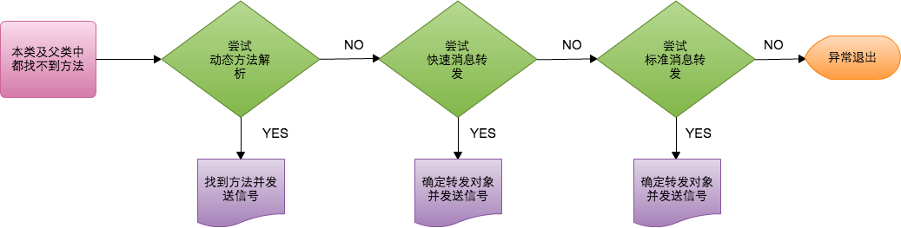

## Runtime

### 前言

对于 runtime，看了很多的文章， 开发过程中也零零碎碎的用到过，感觉都不甚全面。反反复复研究了几次，决定写下来。对于初学者，感觉 runtime 很高深，不敢涉足；对于经常使用 runtime 的人来说，觉得 runtime 就那么点东西，不足为奇。其实在我反复研究它的过程中，每次都有收获，因为它的原理不难，但是涉及很多，它贯穿这门语言，却刀锋尖利。

- 一. runtime 简介
- 二：对象、类的结构
- - objc_object
- - objc_class
- 三、消息传递（Messaging）
- - objc_method
- - objc_msgSend
- 四、动态方法解析和转发
- - 动态方法解析
- - 快速消息转发
- - 标准消息转发
- - 消息转发的用途

### 一. runtime 简介

Objective-C 扩展了 C 语言，并加入了面向对象特性和 Smalltalk 式的消息传递机制。而这个扩展的核心是一个用 C 和 编译语言 写的 Runtime 库。它是 Objective-C 面向对象和动态机制的基石。

Objective-C 是一个动态语言，这意味着它不仅需要一个编译器，也需要一个运行时系统来动态得创建类和对象、进行消息传递和转发。

OC与C语言的区别：

- 对于C语言，函数的调用在编译的时候会决定调用哪个函数。
- 对于OC的函数，属于动态调用过程，在编译的时候并不能决定真正调用哪个函数，只有在真正运行的时候才会根据函数的名称找到对应的函数来调用。
- 在编译阶段，OC可以**调用任何函数**，即使这个函数并未实现，只要声明过就不会报错。
- 在编译阶段，C语言**调用未实现的函数**就会报错。

### 二：对象、类的结构

在了解OC的消息传递之前，我们先明确对象、类的结构。

在OC中，类、对象都是一个C的结构体，从`objc/objc.h`和`objc/runtime.h`头文件中，我们可以找到它们的定义：

```
typedef struct objc_class *Class;
typedef struct objc_object *id;

struct objc_object {
    Class _Nonnull isa  OBJC_ISA_AVAILABILITY; //指向它的类对象
};

struct objc_class {
    Class _Nonnull isa  OBJC_ISA_AVAILABILITY; //isa指针指向Meta Class，因为Objc的类的本身也是一个Object，为了处理这个关系，runtime就创造了Meta Class，当给类发送[NSObject alloc]这样消息时，实际上是把这个消息发给了Class Object

#if !__OBJC2__
    Class _Nullable super_class		OBJC2_UNAVAILABLE; //父类
    const char * _Nonnull name		OBJC2_UNAVAILABLE; //类名
    long version		OBJC2_UNAVAILABLE; //类的版本信息，默认为0
    long info			OBJC2_UNAVAILABLE; //类信息，供运行期使用的一些位标识
    long instance_size		OBJC2_UNAVAILABLE; //该类的实例变量大小
    struct objc_ivar_list * _Nullable ivars		OBJC2_UNAVAILABLE; //该类的成员变量链表
    struct objc_method_list * _Nullable * _Nullable methodLists		OBJC2_UNAVAILABLE; //方法定义的链表
    struct objc_cache * _Nonnull cache		OBJC2_UNAVAILABLE; //方法缓存，对象接到一个消息会根据isa指针查找消息对象，这时会在method Lists中遍历，如果cache了，常用的方法调用时就能够提高调用的效率。
    struct objc_protocol_list * _Nullable protocols		OBJC2_UNAVAILABLE; //协议链表
#endif

} OBJC2_UNAVAILABLE;
```
可以看到有`__OBJC2__ `和`OBJC2_UNAVAILABLE `标识，在objc2中已经不可用了，但在runtime的[源码](https://github.com/opensource-apple/objc4)中，包含的内容大致是一样的，只是结构略有不同。为了简单，我们就以这个定义来理解类和对象的结构是没问题的。

**对象（objc_object）**由isa指针和成员变量组成，其中isa指针指向它的类，其中成员变量包括所有父类和自己的成员变量：

Objective-C 对象的结构图|
-----|
isa指针|
根类的实例变量|
倒数第二层父类的实例变量|
...|
父类的实例变量|
类的实例变量|

//// 加入LLDB 对象结构体输出

**类（objc_class）**主要组成：isa指向元类（Meta Class），`super_class `指向父类、`objc_method_list `存储实例方法。类里面和对象一样也有isa指针，说明类也是个对象，类是元类的实例。

**元类（objc_class）**，在类对象里的isa指针也指向一个`objc_class `类型的结构体，就是元类对象，结构和类对象一样，但是`objc_method_list `存储的是类方法。


### 三、消息传递（Messaging）

>I’m sorry that I long ago coined the term “objects” for this topic because it gets many people to focus on the lesser idea. The big idea is “messaging” – that is what the kernal[sic] of Smalltalk is all about... The key in making great and growable systems is much more to design how its modules communicate rather than what their internal properties and behaviors should be.

Alan Kay 曾多次强调 Smalltalk 的核心不是面向对象，面向对象只是 the lesser ideas，消息传递才是 the big idea。

在很多语言，比如 C ，调用一个方法其实就是跳到内存中的某一点并开始执行一段代码。没有任何动态的特性，因为这在编译时就决定好了。而在 Objective-C 中，[object foo] 语法并不会立即执行 foo 这个方法的代码。它是在运行时给 object 发送一条叫 foo 的消息。这个消息，也许会由 object 来处理，也许会被转发给另一个对象，或者不予理睬假装没收到这个消息。多条不同的消息也可以对应同一个方法实现。这些都是在程序运行的时候决定的。

事实上，在编译时你写的 Objective-C 函数调用的语法都会被翻译成一个 C 的函数调用`-objc_msgSend`。比如，下面两行代码就是等价的：

```
[array insertObject:foo atIndex:5];
objc_msgSend(array, @selector(insertObject:atIndex:), foo, 5);
```

#### 方法的结构（objc_method）

objc_class`里的`objc_method_list`本质是一个有 `objc_method` 元素的可变长度的数组。`objc_method`的定义如下：

```
struct objc_method {
    SEL _Nonnull method_name			OBJC2_UNAVAILABLE;
    char * _Nullable method_types		OBJC2_UNAVAILABLE;
    IMP _Nonnull method_imp				OBJC2_UNAVAILABLE;                            
}                                		OBJC2_UNAVAILABLE;
```

- SEL： 又叫选择器，表示一个方法的名字。Objective-C在编译时，会依据每一个方法的名字、参数序列，生成一个唯一的整型标识(Int类型的地址)，这个标识就是SEL。
- IMP： 实际上是一个函数指针，指向方法实现的首地址。定义：`id (*IMP)(id, SEL, ...)
`
- method_types：表示函数参数及返回值类型的字符串 (见[Type Encoding](https://developer.apple.com/library/content/documentation/Cocoa/Conceptual/ObjCRuntimeGuide/Articles/ocrtTypeEncodings.html)) 

#### objc_msgSend

**消息传递的关键**在于 `objc_object` 中的 isa 指针和 `objc_class` 中的 class dispatch table。举`objc_msgSend(obj, foo)`这个例子来说：

- 首先，通过 obj 的 isa 指针找到它的 class ;
- 在 class 的 method list 找 foo ;
- 如果 class 中没到 foo，继续往它的 superclass 中找 ;
- 旦找到 foo 这个函数，就去执行它的实现IMP .


但这种实现有个问题，效率低。但一个 class 往往只有 20% 的函数会被经常调用，可能占总调用次数的 80% 。每个消息都需要遍历一次`objc_method_list`并不合理。如果把经常被调用的函数缓存下来，那可以大大提高函数查询的效率。这也就是`objc_class`中另一个重要成员`objc_cache`做的事情 —— 再找到 foo 之后，把 foo 的`method_name`作为 key ，`method_imp`作为 value 给存起来。当再次收到 foo 消息的时候，可以直接在 cache 里找到，避免去遍历`objc_method_list`.

#### 隐藏参数

当`objc_msgSend`找到函数的实现，就会调用函数，并传递消息中所有的参数。也传递两个隐藏参数到函数中：

- 接收对象
- 方法选择器

这两个参数为方法的实现提供了调用者的信息。之所以说是隐藏的，是因为它们在定义方法的源代码中没有声明。它们是在编译期被插入实现代码的。

虽然这些参数没有显示声明，但在代码中仍然可以引用它们。我们可以使用self来引用接收者对象，使用_cmd来引用选择器。

#### 避免动态绑定

runtime的动态绑定让我们写代码时更具有灵活性，可以在消息的传递过程中做一些处理，比如转发或者交换方法的实现。不过灵活性也带来了性能上的损耗，毕竟我们需要去查找方法的实现，而不像函数调用来得那么直接。当然，方法的缓存一定程度上解决了这一问题。

如果想要避开这种动态绑定方式，我们可以获取方法实现的地址，然后像调用函数一样来直接调用它。特别是当我们需要在一个循环内频繁地调用一个特定的方法时，通过这种方式可以提高程序的性能。

NSObject类提供了methodForSelector:方法，让我们可以获取到方法的指针，然后通过这个指针来调用实现代码：

```
void (*setter)(id, SEL, BOOL);
int i;
setter = (void (*)(id, SEL, BOOL))[target methodForSelector:@selector(setFilled:)];
for (i = 0 ; i < 1000 ; i++)
    setter(targetList[i], @selector(setFilled:), YES);
```
前两个参数传递给接收对象（self）的程序和方法选择器（_cmd）。这些参数在方法语法中是隐藏的，但当该方法当成函数调用时，必须是显式的。

### 四、动态方法解析和转发

当一个对象能接收一个消息时，就会走正常的方法调用流程，也就是上面的消息传递流程。但如果一个对象无法接收指定消息时，又会发生什么事呢？

当向someObject发送某消息，但runtime system在当前类和父类中都找不到对应方法的实现时，runtime system并不会立即报错使程序崩溃，而是依次执行下列步骤：



流程：

- 动态方法解析
- 快速消息转发
- 标准消息转发
    
#### 动态方法解析（Dynamic Method Resolution）   

对象在接收到未知的消息时，首先会调用所属类的类方法`+resolveInstanceMethod:`(实例方法)或者`+resolveClassMethod:`(类方法)。在这个方法中，我们有机会为该未知消息新增一个”处理方法””。

我们可以在这里添加对该消息的处理方法，并返回YES，则将重新objc_msgSend：

```
+ (BOOL)resolveInstanceMethod:(SEL)aSEL  
{  
    if (aSEL == @selector(resolveThisMethodDynamically)) {  
          class_addMethod([self class], aSEL, (IMP) dynamicMethodIMP, "v@:");  
          return YES;  
    }  
    return [super resolveInstanceMethod:aSEL];  
} 
```

#### 快速消息转发

调用`-forwardingTargetForSelector:`方法，尝试找到一个能响应该消息的对象。如果获取到，则直接把消息转发给它，返回非 nil 对象。否则返回 nil ，继续下面的动作。注意，这里不要返回 self ，否则会形成死循环。

```
- (id)forwardingTargetForSelector:(SEL)aSelector  
{  
    Doctor *doctor = [[Doctor alloc]init];  
    if ([doctor respondsToSelector:aSelector]) {  
        return doctor;  
    }  
    return nil;  
} 
```

这一步我们只想将消息转发到另一个能处理该消息的对象上。但这一步无法对消息进行处理，如操作消息的参数和返回值。

#### 标准消息转发

如果想要对消息进行处理，就可以在这一步操作消息的参数和返回值，还可以让多个对象响应，甚至把消息吞掉。

runtime system会调用`-methodSignatureForSelector:`方法，尝试获得一个方法签名。如果获取不到，则直接调用doesNotRecognizeSelector抛出异常。如果能获取，则返回非nil：runtime system会创建一个 NSlnvocation 并传给`-forwardInvocation:`。

也就是说如果本类没有能响应的方法，`-methodSignatureForSelector:`方法本来应该返回nil，需要重写该方法想办法返回需要的签名，好让runtime system可以调用`-forwardInvocation:`。重写`-forwardInvocation:`，来对消息进行处理（交给其它对象处理、处理消息参数等）。

需要重写`-methodSignatureForSelector:`和`-forwardInvocation:`方法：

```
- (NSMethodSignature *)methodSignatureForSelector:(SEL)aSelector  
{  
    NSMethodSignature* signature = [super methodSignatureForSelector:aSelector];  
    if (signature==nil) {  
        signature = [someObj methodSignatureForSelector:aSelector];  
    }  
    NSUInteger argCount = [signature numberOfArguments];  
    for (NSInteger i=0 ; i<argCount ; i++) {  
    	//操作参数
    }  
      
    return signature;  
}  
  
- (void)forwardInvocation:(NSInvocation *)anInvocation  
{  
    SEL seletor = [anInvocation selector];  
    if ([someObj respondsToSelector:seletor]) {  
        [anInvocation invokeWithTarget:someObj];  
    }  
      
}  
```

#### 两种消息转发方式的比较

- 快速消息转发：简单、快速、但仅能转发给一个对象。
- 标准消息转发：稍复杂、较慢、但转发操作实现可控，可以实现多对象转发。

#### 消息转发的用途

- **多重继承**

转发类似继承，可以用来支持Objective-C 编程的多重继承的某些效果。一个对象通过转发消息来响应消息，该对象似乎是借或者“继承”另一个类中实现的方法。如下图所示：


不过消息转发虽然类似于继承，但NSObject的一些方法还是能区分两者。如`-respondsToSelector:`和`-isKindOfClass:`只能用于继承体系，而不能用于转发链。便如果我们想让这种消息转发看起来像是继承，则可以重写这些方法。

- **代理对象**

转发不仅模仿多重继承，还可以开发轻量级对象代表原来的对象。代理代替原来的对象并传送消息给原来的对象。

苹果给了更为纯净的类[NSProxy]()，专门处理消息转发。

### 五、Method Swizzling

其实runtime的概念、特性已经讲完了。现在来说一下runtime很强大的一个黑色技能：Method Swizzling。

Method Swizzling 利用 Runtime 特性把一个方法的实现与另一个方法的实现进行替换。

**消息传递** 中有讲到，每个类里都有一个 dispatch table ，将方法的名字（SEL）跟方法的实现（IMP，指向 C 函数的指针）一一对应。swizzle 一个方法其实就是在程序运行时在 dispatch table 里做点改动，让这个方法的名字（SEL）对应到另个 IMP 。

转换前，一一对应：


转换后，交换一一对应：


在`objc/runtime.h`中，OC提供了以下API来动态替换方法的实现：

- `class_replaceMethod`
- `method_setImplementation`
- `method_exchangeImplementations`

这些方法归根结底，都是偷换了method的IMP。

#### class_replaceMethod

```
class_replaceMethod(Class _Nullable cls, SEL _Nonnull name, IMP _Nonnull imp, 
                    const char * _Nullable types) 
```

在文档中详细说明了，它有两种不同的行为。当类中没有想替换的原方法时，该方法会调用 `class_addMethod` 来为该类增加一个新方法。也因此它需要在调用时传入types参数，而`method_exchangeImplementations`和`method_setImplementation`却不需要。

#### method_setImplementation

最简单，仅仅是给一个方法设置其实现方式。

#### method_exchangeImplementations

顾名思义，是交换两个方法的实现，等同于调用两次`method_setImplementation `：

```
IMP imp1 = method_getImplementation(m1);
IMP imp2 = method_getImplementation(m2);
method_setImplementation(m1, imp2);
method_setImplementation(m2, imp1);
```

#### Method Swizzling 的应用

有时候我们想对已有类的已有实现增加一些额外处理，这时候我们可以在已有类的分类中做Method Swizzling。

下面我们在UIControl的分类里，将`-setTag:`和自定义的`-xxx_setTag:`方法交换：

```
- (void)xxx_setTag:(NSInteger)tag {
    NSLog(@"%s  tag=%ld", __FUNCTION__, tag);
    return [self xxx_setTag:tag];
}
```
上面是自定义`-xxx_setTag:`方法的实现，乍一看像是递归。但是别忘了我们是要调换方法的IMP的，在runtime的时候，函数实现已经被交换了。调用`-setTag:`会调用你实现的`-xxx_setTag:`，而在 `-xxx_setTag:`里调用`-xxx_setTag:`实际上调用的是原来的`-setTag:`。

```
//UIControl+XXXExtension.m
+ (void)load {
    static dispatch_once_t onceToken;
    dispatch_once(&onceToken, ^{
        Class class = [self class];
        
        //1
        SEL originalSelector = @selector(setTag:);
        SEL swizzledSelector = @selector(xxx_setTag:);
        //2
        Method originalMethod = class_getInstanceMethod(class, originalSelector);
        Method swizzledMethod = class_getInstanceMethod(class, swizzledSelector);
        
        // When swizzling a class method, use the following:
        // Class class = object_getClass((id)self);
        // ...
        // Method originalMethod = class_getClassMethod(class, originalSelector);
        // Method swizzledMethod = class_getClassMethod(class, swizzledSelector);

        //3
        BOOL didAddMethod = class_addMethod(class,
                                            originalSelector,
                                            method_getImplementation(swizzledMethod),
                                            method_getTypeEncoding(swizzledMethod));

        if (didAddMethod) {
        //4
            class_replaceMethod(class,
                                swizzledSelector,
                                method_getImplementation(originalMethod),
                                method_getTypeEncoding(originalMethod));
        } else {
        //5
            method_exchangeImplementations(originalMethod, swizzledMethod);
        }
    });
}
```

1. 拿到要交换的两个方法名SEL
2. 通过方法名SEL，拿到方法对象Method
3. 在交换方法前，先调用了`class_addMethod`。是因为要保证所交换的原方法是本类的方法，不是父类的方法。`class_addMethod`会覆盖父类的方法实现，但是不会替换本类已经有的方法实现。所以先做一层`class_addMethod`保证了本类本身有原方法的实现。
4. 如果本类没有相应的原方法实现，`class_addMethod`会成功添加一个原方法，实现IMP设置为新的实现。然后通过`class_replaceMethod`在新方法名义下设置原方法的实现。
5. 如果本类有相应的原方法实现，`method_exchangeImplementations `交换两个方法的实现。

通常我们方法混写是想要在应用程序的整个生命周期中有效，所以把method swizzling的代码放在`+load`的dispatch once中，是为了保证它的执行是线程安全的，并且只执行一次。[了解更多关于+load](https://github.com/liuyanhongwl/ios_common/blob/master/files/load_initialize.md)

然后我们来调用一下混写后的方法：

```
 UIControl *ctrl = [[UIControl alloc] init];
 ctrl.tag = 10;
    
 UIView *view = [[UIView alloc] init];
 view.tag = 100;
```

控制台输出：

```
-[UIControl(XXXExtension) xxx_setTag:]  tag=10
```

从输出中，可以知道新方法只应用于UIControl的对象，并不影响其父类UIView的对象。这就因为我们只交换了UIControl类的方法，明显UIControl本身没有`-setTag:`方法，所以会通过`class_addMethod`添加一个，所以不影响其父类UIView。

#### Method Swizzling 注意事项

- Method swizzling is not atomic

很明显方法混写的代码要完整的执行程序才会正常执行，正如我们在`+load`方法中执行dispatch once。

- Changes behavior of un-owned code

混写的方法不止对一个实例有效，是对目标类的所有实例。我们改变了目标类，所以swizzling是很重要的事，要十分小心。

- Possible naming conflicts

命名冲突贯穿整个Cocoa的问题，我们常常在类名和类别方法名前加上前缀，所以我们也在新方法的前面加前缀，就像前面代码里的`-xxx_setTag:`。但如果`-xxx_setTag:`在别处也定义了怎么办？这个问题不仅仅存在于swizzling，这我们可以用别的变通的方法：

直接用新的 IMP 取代原 IMP ，而不是替换。只需要有全局的函数指针指向原 IMP 就可以。

```
static void (*gOriginalSetTagIMP)(id self, SEL _cmd, NSInteger tag);

static void xxxSetTag(id self, SEL _cmd, NSInteger tag) {
    // do custom work
    NSLog(@"%s  tag=%ld", __FUNCTION__, tag);
    gOriginalSetTagIMP(self, _cmd, tag);
}

+ (void)load {
    static dispatch_once_t onceToken;
    dispatch_once(&onceToken, ^{    
     
        Method originalMethod = class_getInstanceMethod(self, @selector(setTag:));
        gOriginalSetTagIMP = (void *)method_getImplementation(originalMethod);
        
        if(!class_addMethod(self, @selector(setTag:), (IMP)xxxSetTag, method_getTypeEncoding(originalMethod))) {
            method_setImplementation(originalMethod, (IMP)xxxSetTag);
        }
    });
}
```

注意这里的自定义实现`xxxSetTag`里不能再调用`xxxSetTag`本身了，不然就真的递归了。因为这里调用的是函数，直接调用，不走runtime的消息传递了。

或者用OC提供的`imp_implementationWithBlock `，直接用block生成对应的实现IMP：

```
Method originalMethod = class_getInstanceMethod(self, @selector(setTag:));
IMP originalImp = method_getImplementation(originalMethod);

IMP swizzledImp = imp_implementationWithBlock(^(id target, SEL cmd, NSInteger tag){
	NSLog(@"%s  tag=%ld", __FUNCTION__, tag);
	void (*func)(id, SEL, NSInteger) = (void(*)(id, SEL, NSInteger))originalImp;
	func(target, cmd, tag);
});
        
if(!class_addMethod(self, @selector(setTag:), (IMP)swizzledImp, method_getTypeEncoding(originalMethod))) {
	method_setImplementation(originalMethod, (IMP)swizzledImp);
}
```

- Swizzling changes the method's arguments

- The order of swizzles matters

- Difficult to understand (looks recursive)

- Difficult to debug


### 参考

- [Objective-C Runtime Programming Guide 译](http://blog.csdn.net/iosswift/article/details/42245647)
- [Objective-C 的“多继承”](http://blog.csdn.net/yiyaaixuexi/article/details/8970734)
- [Objective-C的hook方案（一）: Method Swizzling](http://blog.csdn.net/yiyaaixuexi/article/details/9374411)
- [Objective-C Runtime](http://tech.glowing.com/cn/objective-c-runtime/)
- [Method Swizzling 和 AOP 实践](http://tech.glowing.com/cn/method-swizzling-aop/)
- [Associated Objects](http://nshipster.cn/associated-objects/)
- [Method Swizzling](http://nshipster.cn/method-swizzling/)
- [Runtime 六部文章](http://southpeak.github.io/categories/objectivec/)
- [为所欲为之API兼容-Runtime消息转发](http://www.jianshu.com/p/215eccc37f5e?utm_source=desktop&utm_medium=timeline)