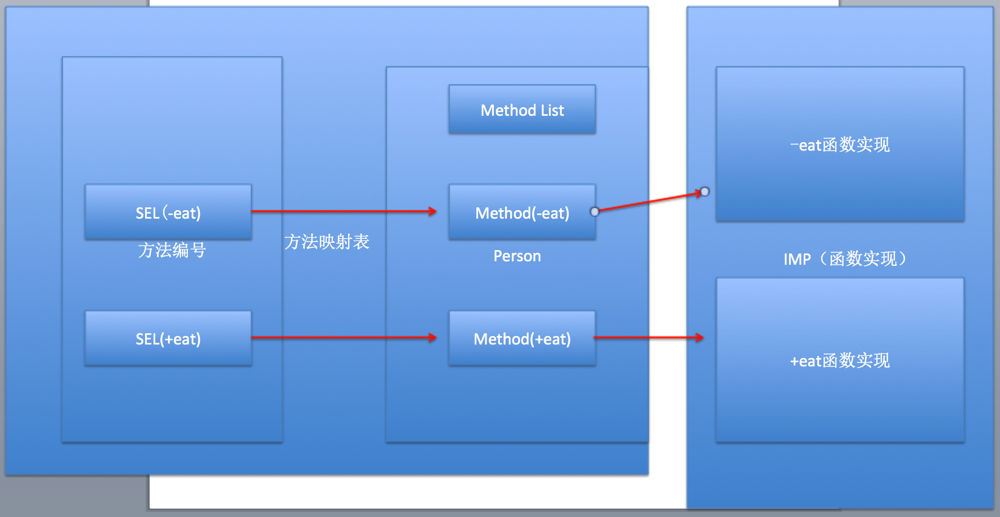

## Runtime

### 一. runtime 简介
* RunTime简称运行时。OC就是运行时机制，也就是在运行时候的一些机制，其中最主要的是消息机制
* 对于C语言，函数的调用在编译的时候会决定调用哪个函数。
* 对于OC的函数，属于动态调用过程，在编译的时候并不能决定真正调用哪个函数，只有在真正运行的时候才会根据函数的名称找到对应的函数来调用。
* 事实证明：
* * 在编译阶段，OC可以`调用任何函数`，即使这个函数并未实现，只要声明过就不会报错。
* * 在编译阶段，C语言`调用未实现的函数`就会报错。


### 二. runtime 作用

#### 1. 发送消息

objc_msgSend

* `方法调用的本质`，就是让对象发送消息。
* 使用`消息机制`前提，必须导入#import <objc/message.h>

```
// 创建person对象
    Person *p = [[Person alloc] init];

    // 调用对象方法
    [p eat];
    
    // 本质：让对象发送消息
    objc_msgSend(p, @selector(eat));
    
    // 调用类方法的方式：两种
    // 第一种：通过类名调用
    [Person eat];
    // 第二种：通过类对象调用
    [[Person class] eat];
    
    // 用类名调用类方法，底层会自动把类名转换成类对象调用
    // 本质：让类对象发送消息
    objc_msgSend([Person class], @selector(eat));
```
* 消息机制原理：对象根据方法编号SEL去映射表查找对应的方法实现



编绎报错，解决方法objc_msgSend too many arguments to function call,expected 0, have3   

**解决**

* 方法一：Build Setting--> Apple LLVM 6.0 - Preprocessing--> Enable Strict Checking of objc_msgSend Calls  改为 NO

* 方法二： [参考](!http://www.cnphp6.com/archives/58271)

```
Person *p = [[Person alloc] init];
    
int (*action)(id, SEL, NSString *) = (int (*)(id, SEL, NSString *)) objc_msgSend;
    
action(p, @selector(eatWithFriend:), @"小明");
```


#### 交换实现

#### 动态绑定
解决类中方法过多，加载到内存时比较耗资源（为了生成方法的映射表）


#### 字典转模型

KVO 

runtime
