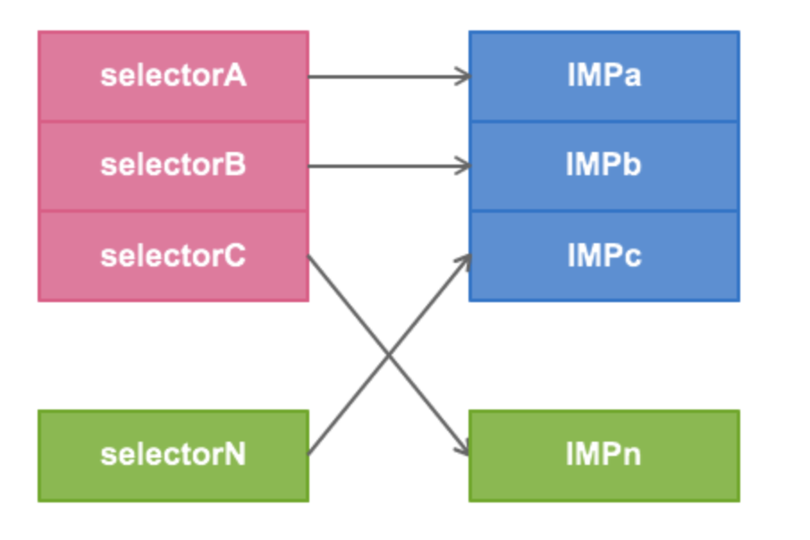
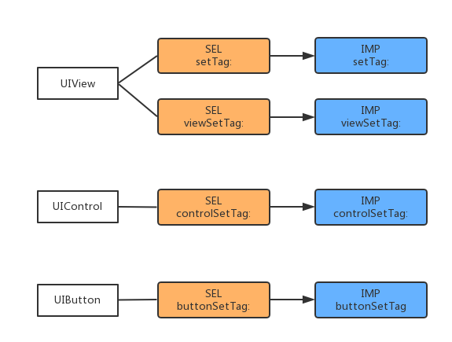
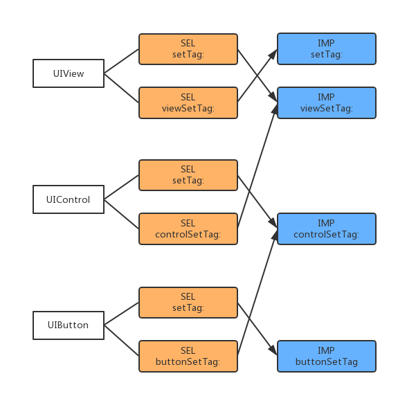
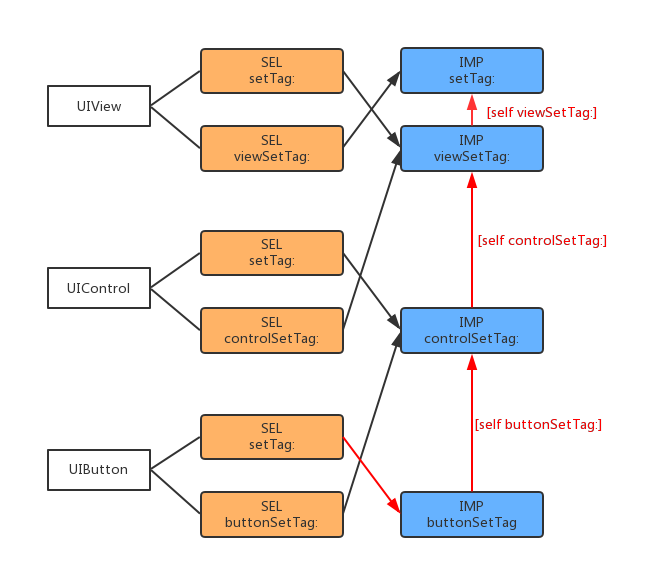
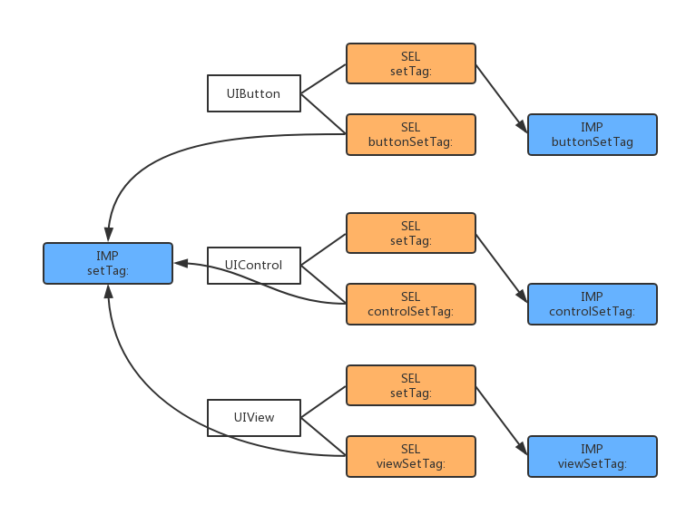
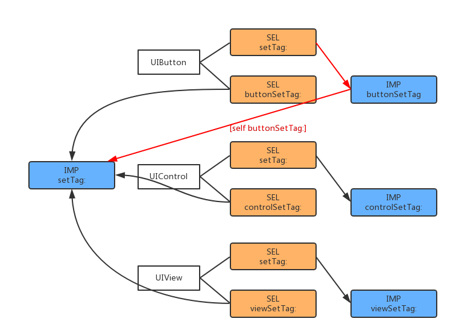

## Runtime 3 Method Swizzling

## Method Swizzling

其实runtime的概念、特性已经讲完了。现在来说一下runtime很强大的一个黑色技能：Method Swizzling。

Method Swizzling 利用 Runtime 特性把一个方法的实现与另一个方法的实现进行替换。

**消息传递** 中有讲到，每个类里都有一个 dispatch table ，将方法的名字（SEL）跟方法的实现（IMP，指向 C 函数的指针）一一对应。swizzle 一个方法其实就是在程序运行时在 dispatch table 里做点改动，让这个方法的名字（SEL）对应到另个 IMP 。

转换前，一一对应：


转换后，交换一一对应：



在`objc/runtime.h`中，OC提供了以下API来动态替换方法的实现：

- `class_replaceMethod`
- `method_setImplementation`
- `method_exchangeImplementations`

这些方法归根结底，都是偷换了method的IMP。

### class_replaceMethod

```
class_replaceMethod(Class _Nullable cls, SEL _Nonnull name, IMP _Nonnull imp, 
                    const char * _Nullable types) 
```

在文档中详细说明了，它有两种不同的行为。当类中没有想替换的原方法时，该方法会调用 `class_addMethod` 来为该类增加一个新方法。也因此它需要在调用时传入types参数，而`method_exchangeImplementations`和`method_setImplementation`却不需要。

### method_setImplementation

最简单，仅仅是给一个方法设置其实现方式。

### method_exchangeImplementations

顾名思义，是交换两个方法的实现，等同于调用两次`method_setImplementation `：

```
IMP imp1 = method_getImplementation(m1);
IMP imp2 = method_getImplementation(m2);
method_setImplementation(m1, imp2);
method_setImplementation(m2, imp1);
```

### Method Swizzling 的应用

有时候我们想对已有类的已有实现增加一些额外处理，这时候我们可以在已有类的分类中做Method Swizzling。

下面我们在UIControl的分类里，将`-setTag:`和自定义的`-xxx_setTag:`方法交换：

```
- (void)xxx_setTag:(NSInteger)tag {
	NSLog(@"%s  %@  tag=%ld", __FUNCTION__, NSStringFromSelector(_cmd), tag);
    return [self xxx_setTag:tag];
}
```
上面是自定义`-xxx_setTag:`方法的实现，乍一看像是递归。但是别忘了我们是要调换方法的IMP的，在runtime的时候，函数实现已经被交换了。调用`-setTag:`会调用你实现的`-xxx_setTag:`，而在 `-xxx_setTag:`里调用`-xxx_setTag:`实际上调用的是原来的`-setTag:`。

```
//UIControl+XXXExtension.m
+ (void)load {
    static dispatch_once_t onceToken;
    dispatch_once(&onceToken, ^{
        Class class = [self class];
        
        //1
        SEL originalSelector = @selector(setTag:);
        SEL swizzledSelector = @selector(xxx_setTag:);
        //2
        Method originalMethod = class_getInstanceMethod(class, originalSelector);
        Method swizzledMethod = class_getInstanceMethod(class, swizzledSelector);
        
        // When swizzling a class method, use the following:
        // Class class = object_getClass((id)self);
        // ...
        // Method originalMethod = class_getClassMethod(class, originalSelector);
        // Method swizzledMethod = class_getClassMethod(class, swizzledSelector);

        //3
        BOOL didAddMethod = class_addMethod(class,
                                            originalSelector,
                                            method_getImplementation(swizzledMethod),
                                            method_getTypeEncoding(swizzledMethod));

        if (didAddMethod) {
        //4
            class_replaceMethod(class,
                                swizzledSelector,
                                method_getImplementation(originalMethod),
                                method_getTypeEncoding(originalMethod));
        } else {
        //5
            method_exchangeImplementations(originalMethod, swizzledMethod);
        }
    });
}
```

1. 拿到要交换的两个方法名SEL
2. 通过方法名SEL，拿到方法对象Method
3. 在交换方法前，先调用了`class_addMethod`。是因为要保证所交换的原方法是本类的方法，不是父类的方法。`class_addMethod`会覆盖父类的方法实现，但是不会替换本类已经有的方法实现。所以先做一层`class_addMethod`保证了本类本身有原方法的实现。
4. 如果本类没有相应的原方法实现，`class_addMethod`会成功添加一个原方法，实现IMP设置为新的实现。然后通过`class_replaceMethod`在新方法名义下设置原方法的实现。
5. 如果本类有相应的原方法实现，`method_exchangeImplementations `交换两个方法的实现。

通常我们方法混写是想要在应用程序的整个生命周期中有效，所以把method swizzling的代码放在`+load`的dispatch once中，是为了保证它的执行是线程安全的，并且只执行一次。[了解更多关于+load](https://github.com/liuyanhongwl/ios_common/blob/master/files/load_initialize.md)

然后我们来调用一下混写后的方法：

```
 UIControl *ctrl = [[UIControl alloc] init];
 ctrl.tag = 10;
    
 UIView *view = [[UIView alloc] init];
 view.tag = 100;
```

控制台输出：

```
-[UIControl(XXXExtension) xxx_setTag:]  tag=10
```

从输出中，可以知道新方法只应用于UIControl的对象，并不影响其父类UIView的对象。这就因为我们只交换了UIControl类的方法，明显UIControl本身没有`-setTag:`方法，所以会通过`class_addMethod`添加一个，所以不影响其父类UIView。

### Method Swizzling 注意事项

- Method swizzling is not atomic
- Changes behavior of un-owned code
- Possible naming conflicts
- Swizzling changes the method's arguments
- The order of swizzles matters
- Difficult to understand (looks recursive)
- Difficult to debug

#### - Method swizzling is not atomic

很明显方法混写的代码要完整的执行，程序才会正常执行，正如我们在`+load`方法中执行dispatch once。

#### - Changes behavior of un-owned code

混写的方法不止对一个实例有效，是对目标类的所有实例。我们改变了目标类，所以swizzling是很重要的事，要十分小心。

#### - Possible naming conflicts

命名冲突贯穿整个Cocoa的问题，我们常常在类名和类别方法名前加上前缀，所以我们也在新方法的前面加前缀，就像前面代码里的`-xxx_setTag:`。但如果`-xxx_setTag:`在别处也定义了怎么办？这个问题不仅仅存在于swizzling，这我们可以用别的变通的方法：

直接用新的 IMP 取代原 IMP ，而不是替换。只需要有全局的函数指针指向原 IMP 就可以。

```
static void (*gOriginalSetTagIMP)(id self, SEL _cmd, NSInteger tag);

static void xxxSetTag(id self, SEL _cmd, NSInteger tag) {
    // do custom work
    NSLog(@"%s  tag=%ld", __FUNCTION__, tag);
    gOriginalSetTagIMP(self, _cmd, tag);
}

+ (void)load {
    static dispatch_once_t onceToken;
    dispatch_once(&onceToken, ^{    
     
        Method originalMethod = class_getInstanceMethod(self, @selector(setTag:));
        gOriginalSetTagIMP = (void *)method_getImplementation(originalMethod);
        
        if(!class_addMethod(self, @selector(setTag:), (IMP)xxxSetTag, method_getTypeEncoding(originalMethod))) {
            method_setImplementation(originalMethod, (IMP)xxxSetTag);
        }
    });
}
```

注意这里的自定义实现`xxxSetTag`里不能再调用`xxxSetTag`本身了，不然就真的递归了。因为这里调用的是函数，直接调用，不走runtime的消息传递了。

或者用OC提供的`imp_implementationWithBlock `，直接用block生成对应的实现IMP：

```
Method originalMethod = class_getInstanceMethod(self, @selector(setTag:));
IMP originalImp = method_getImplementation(originalMethod);
SEL originalSel = method_getName(originalMethod);
    
IMP swizzledImp = imp_implementationWithBlock(^(id target, NSInteger tag){
	NSLog(@"%s   tag=%ld", __FUNCTION__, tag);
	void (*func)(id, SEL, NSInteger) = (void(*)(id, SEL, NSInteger))originalImp;
	func(target, originalSel, tag);
});
    
if(!class_addMethod(self, @selector(setTag:), (IMP)swizzledImp, method_getTypeEncoding(originalMethod))) {
	method_setImplementation(originalMethod, (IMP)swizzledImp);
}
```

#### - Swizzling changes the method's arguments

method swizzling 后的方法，想正常调用的话，将是个问题。

比如如果想直接调用`xxx_setTag:`方法：

```
[self xxx_setTag:12];
```

runtime 的做法是：

```
objc_msgSend(self, @selector(xxx_setTag:), 12);  
```

runtime去寻找`xxx_setTag:`的方法实现, `_cmd`参数为`xxx_setTag:` ，但是事实上runtime找到的方法实现是原始的`setTag:`的。

解决方法：使用全局的函数指针IMP。

#### - The order of swizzles matters

多个swizzle方法的执行顺序也需要注意。那么应该是什么顺序呢，从父类->子类的顺序交换，还是从父类->子类的顺序？

举个例子，在UIView、UIControl、UIButton的分类里面分别自定义如下代码，准备与原来的`-setTag:`方法进行交换：

```
//  UIView+LYHExtension.m
- (void)viewSetTag:(NSInteger)tag {
    NSLog(@"%s   cmd=%@  tag=%ld", __FUNCTION__, NSStringFromSelector(_cmd), tag);
    return [self viewSetTag:tag];
}

//  UIControl+LYHExtension.m
- (void)controlSetTag:(NSInteger)tag {
    NSLog(@"%s   cmd=%@  tag=%ld", __FUNCTION__, NSStringFromSelector(_cmd), tag);
    return [self controlSetTag:tag];
}

//  UIButton+LYHExtension.m
- (void)buttonSetTag:(NSInteger)tag {
    NSLog(@"%s   cmd=%@  tag=%ld", __FUNCTION__, NSStringFromSelector(_cmd), tag);
    return [self buttonSetTag:tag];
}
```

从父类->子类的顺序进行method swizzle：

```
[UIView swizzle:@selector(setTag:) withSelector:@selector(viewSetTag:)];
[UIControl swizzle:@selector(setTag:) withSelector:@selector(controlSetTag:)];
[UIButton swizzle:@selector(setTag:) withSelector:@selector(buttonSetTag:)];
```

这里新写了一个方法`-swizzle: withSelector:`，实现跟上面`+load`方法里的方法交换一样。

**交换前：**



**按父类->子类的顺序交换后：**



创建一个UIButton的实例，然后调用一下`-setTag:`，因为在自定义的方法里的实现是用`NSLog`打印当前方法信息，以及调用原来的方法。那就看一下控制台：

```
-[UIButton(XXXExtension) buttonSetTag:]   cmd=setTag:  tag=100
-[UIControl(XXXExtension) controlSetTag:]   cmd=buttonSetTag:  tag=100
-[UIView(XXXExtension) viewSetTag:]   cmd=controlSetTag:  tag=100
```

用图表示更清晰，**按父类->子类的顺序交换后，调用子类的`-setTag:`方法：**



很明显，这种从父类->子类的交换顺序，能正常实现我们想要的流程，也就是子类中拿到的方法，是父类已经swizzle后的代码。

反过来，子类->父类的顺序进行method swizzle：

**按子类->父类的顺序交换后：**



很明显，每层的子类（UIButton、UIControl）都是直接跟拥有原始方法的父类（UIView）直接进行交换，不管是否跨层级。

依然创建一个UIButton的实例，调用一下`-setTag:`，控制台：

```
-[UIButton(XXXExtension) buttonSetTag:]   cmd=setTag:  tag=100
```

控制台只打印了UIButton的自定义方法，没有继承父类UIControl和祖父类UIView的自定义方法。

**按子类->父类的顺序交换后，调用子类的`-setTag:`方法：**




>多个有继承关系的类的对象swizzle时，先从父对象开始。 这样才能保证子类方法拿到父类中的被swizzle的实现。在+(void)load中swizzle不会出错，就是因为load类方法会默认从父类开始调用。


#### - Difficult to understand (looks recursive)

新方法的实现看起来像递归，但是看看上面已经给出的 swizzling 封装方法, 使用起来就很易读懂。

解决方法：使用全局的函数指针IMP。

#### - Difficult to debug

使用`NSStringFromSelector(_cmd)`打印出的方法名调用的方法名，`__FUNCTION__`打印出的方法名是真正实现的方法名。这块可能会混乱，毕竟交换了方法，就像A的实现是B，B的实现是A，不是平常看到的代码那么直接，这块需要思考，一不小心就会忘了。

解决方法：充分的文档，即使只有你一个人开发。
