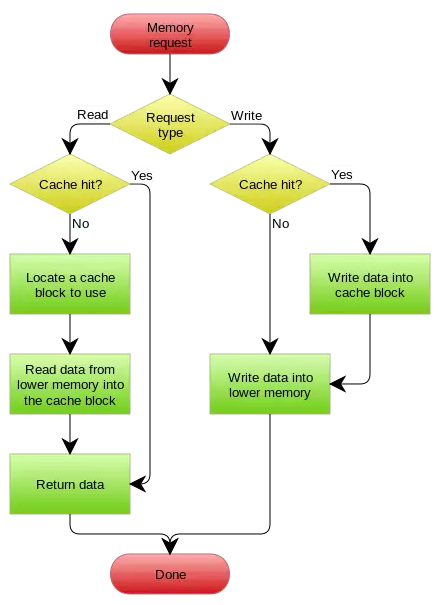

## 更新缓存的设计模式

### Cache Aside Pattern

- 失效：应用程序先从cache取数据，没有得到，则从数据库中取数据，成功后，放到缓存中。
- 命中：应用程序从cache中取数据，取到后返回。
- 更新：先把数据存到数据库中，成功后，再让缓存失效

### Read/Write Through Pattern

### Write Behind Caching Pattern

