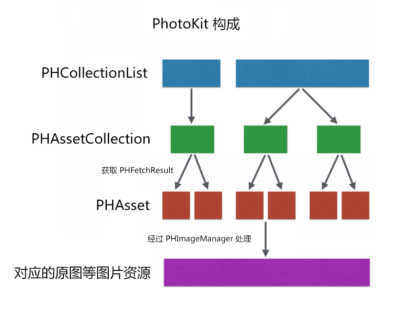

### Photos.framework
-----

参考： [iOS开发之照片框架详解](http://kayosite.com/ios-development-and-detail-of-photo-framework.html/comment-page-1)

#### 一.PhotoKit简介

PhotoKit 是一套比 AssetsLibrary 更完整也更高效的库，对资源的处理跟 AssetsLibrary 也有很大的不同。

首先简单介绍几个概念：

* **PHAsset**: 代表照片库中的一个资源，跟 ALAsset 类似，通过 PHAsset 可以获取和保存资源
* **PHFetchOptions**: 获取资源时的参数，可以传 nil，即使用系统默认值
* **PHFetchResult**: 表示一系列的资源集合，也可以是相册的集合
* **PHAssetCollection**: 表示一个相册或者一个时刻，或者是一个「智能相册（系统提供的特定的一系列相册，例如：最近删除，视频列表，收藏等等，如下图所示）
* **PHImageManager**: 用于处理资源的加载，加载图片的过程带有缓存处理，可以通过传入一个 PHImageRequestOptions 控制资源的输出尺寸等规格
* **PHImageRequestOptions**: 如上面所说，控制加载图片时的一系列参数


PhotoKit 相对 AssetsLibrary 主要有三点重要的改进：

* 从 AssetsLibrary 中获取数据，无论是相册，还是资源，本质上都是使用枚举的方式，遍历照片库取得相应的数据。而 PhotoKit 则是通过传入参数，直接获取相应的数据，因而效率会提高不少。
* 在 AssetsLibrary 中，相册和资源是对应不同的对象（ALAssetGroup 和 ALAsset），因此获取相册和获取资源是两个完全没有关联的接口。而 PhotoKit 中则有 PHFetchResult 这个可以统一储存相册或资源的对象，因此处理相册和资源时也会比较方便。
* PhotoKit 返回资源结果时，同时返回了资源的元数据，获取元数据在 AssetsLibrary 中是很难办到的一件事。同时通过 PHAsset，开发者还能直接获取资源是否被收藏（favorite）和隐藏（hidden），拍摄图片时是否开启了 HDR 或全景模式，甚至能通过一张连拍图片获取到连拍图片中的其他图片。这也是文章开头说的，PhotoKit 能更好地与设备照片库接入的一个重要因素。

关于 PhotoKit，建议可以参考 Apple 的 [Example app using Photos framework](https://developer.apple.com/library/ios/samplecode/UsingPhotosFramework/Introduction/Intro.html#//apple_ref/doc/uid/TP40014575)

额外概念 PHCollectionList ：    <br>
表示一组 PHCollection，它本身也是一个 PHCollection，因此 PHCollection 作为一个集合，可以包含其他集合，这使到 PhotoKit 的组成比 ALAssetLibrary 要复杂一些。另外与 ALAssetLibrary 相似，一个 PHAsset 可以同时属于多个不同的 PHAssetCollection，最常见的例子就是刚刚拍摄的照片，至少同时属于“最近添加”、“相机胶卷”以及“照片 - 精选”这三个 PHAssetCollection。关于这几个概念的关系如下图：


#### 二. PhotoKit 的机制

##### 1. 获取资源

如何获取代表资源的Asset

ALAssetLibrary 中是通过枚举的方式获取相应数据：ALAssetLibrary(照片库) - ALAssetGroup(相册) - ALAsset(资源)

PhotoKit中，采用“获取”的方式拉去资源

##### 2. 获取图像的方式与坑点

与ALAssetLibrary中ALAsset中直接获取图像的方式不同， PhotoKit无法直接从PHAsset的实例中获取图像，而是引入了一个管理器PHImageManager获取图像。

```
- (PHImageRequestID)requestImageForAsset:(PHAsset *)asset 
                              targetSize:(CGSize)targetSize 
                             contentMode:(PHImageContentMode)contentMode 
                                 options:(nullable PHImageRequestOptions *)options 
                           resultHandler:(void (^)(UIImage *__nullable result, NSDictionary *__nullable info))resultHandler;
```
* asset: 图像对应的PHAsset。
* targetSize: 需要获取的图像的尺寸，如果输入的尺寸大于资源原图的尺寸，则只返回原图。**需要注意在 PHImageManager 中，所有的尺寸都是用 Pixel 作为单位（Note that all sizes are in pixels），因此这里想要获得正确大小的图像，需要把输入的尺寸转）换为 Pixel。如果需要返回原图尺寸，可以传入 PhotoKit 中预先定义好的常量 PHImageManagerMaximumSize，** 表示返回可选范围内的最大的尺寸，即原图尺寸。
* contentMode, 图像的剪裁方式，与UIView的contentMode参数相似，控制照片应该以按比例缩放还是按比例填充的方式放到最终展示的容器内。**注意如果 targetSize 传入 PHImageManagerMaximumSize，则 contentMode 无论传入什么值都会被视为 PHImageContentModeDefault。**
* options，一个 PHImageRequestOptions 的实例，可以控制的内容相当丰富，包括图像的质量、版本，也会有参数控制图像的剪裁，下面再展开说明。
* resultHandler，请求结束后被调用的 block，返回一个包含资源对于图像的 UIImage 和包含图像信息的一个 NSDictionary，在整个请求的周期中，这个 block 可能会被多次调用（需要iCloud 中下载资源时）

###### 2.1. PHImageRequestOptions 与 iCloud 照片库

PHImageRequestOptions 中包含了一系列控制请求图像的属性。

* resizeMode 属性控制图像的剪裁，不知道为什么 PhotoKit 会在请求图像方法（requestImageForAsset）中已经有控制图像剪裁的参数后（contentMode），还在 options 中加入控制剪裁的属性，但如果两个地方所控制的剪裁结果有所冲突，PhotoKit 会以 resizeMode 的结果为准。另外，resizeMode 也有控制图像质量的作用。如 resizeMode 设置为 PHImageRequestOptionsResizeModeExact 则返回图像必须和目标大小相匹配，并且图像质量也为高质量图像，而设置为 PHImageRequestOptionsResizeModeFast 则请求的效率更高，但返回的图像可能和目标大小不一样并且质量较低。

在 PhotoKit 中，对 iCloud 照片库有很好的支持，如果用户开启了 iCloud 照片库，并且选择了“优化 iPhone/iPad 储存空间”，或者选择了“下载并保留原件”但原件还没有加载好的时候，PhotoKit 也会预先拿到这些非本地图像的 PHAsset，但是由于本地并没有原图，所以如果产生了请求高清图的请求，PHotoKit 会尝试从 iCloud 下载图片，而这个行为最终的表现，会被 PHImageRequestOptions 中的值所影响。PHImageRequestOptions 中常常会用的几个属性如下：

* networkAccessAllowed 参数控制是否允许网络请求，默认为 NO，如果不允许网络请求，那么就没有然后了，当然也拉取不到 iCloud 的图像原件。
* deliveryMode 则用于控制请求的图片质量。
* synchronous 控制是否为同步请求，默认为 NO，如果 synchronous 为 YES，即同步请求时，deliveryMode 会被视为 PHImageRequestOptionsDeliveryModeHighQualityFormat，即自动返回高质量的图片，因此不建议使用同步请求，否则如果界面需要等待返回的图像才能进一步作出反应，则反应时长会很长。
* 还有一个与 iCloud 密切相关的属性 progressHandler，当图像需要从 iCloud 下载时，这个 block 会被自动调用，block 中会返回图像下载的进度，图像的信息，出错信息。开发者可以利用这些信息反馈给用户当前图像的下载进度以及状况，但需要注意 progressHandler 不在主线程上执行，因此在其中需要操作 UI，则需要手工放到主线程执行。

上面有提到，requestImageForAsset 中的参数 resultHandler 可能会被多次调用，这种情况就是图像需要从 iCloud 中下载的情况。在 requestImageForAsset 返回的内容中，一开始的那一次请求中会返回一个小尺寸的图像版本，当高清图像还在下载时，开发者可以首先给用户展示这个低清的图像版本，然后 block 在多次调用后，最终会返回高清的原图。至于当前返回的图像是哪个版本的图像，可以通过 block 返回的 NSDictionary info 中获知，PHImageResultIsDegradedKey 表示当前返回的 UIImage 是低清图。如果需要判断是否已经获得高清图，可以这样判断：

```
// 排除取消，错误，低清图三种情况，即已经获取到了高清图
BOOL downloadFinined = ![[info objectForKey:PHImageCancelledKey] boolValue] && ![info objectForKey:PHImageErrorKey] && ![[info objectForKey:PHImageResultIsDegradedKey] boolValue];
```
    
**另外，当我们使用 requestImageForAsset 发出对图像的请求时，如果在同一个 PHImageManager 中同时对同一个资源发出图像请求，请求的进度是可以共享的，因此我们可以利用这个特性，把 PHImageManager 以单例的形式使用，这样在切换界面时也不用担心无法传递图像的下载进度。例如，在图像的列表页面触发了下载图像，当我们离开列表页面进入预览大图界面时，并不用担心会重新图像会重新下载，只要没有手工取消图像下载，进入预览大图界面下载图像会自动继续从上次的进度下载图像。**
    
如果希望取消下载图像，则可以使用 PHImageManager 的  cancelImageRequest 方法，它传入的是请求图像的请求 ID，这个 ID 可以从 requestImageForAsset 的返回值中获得，也可以从前面提到的包含图像信息的 NSDictionary info 中获得，当然前提是这个这个接收取消请求的 PHImageManager 与刚刚发出请求的 PHImageManager 是同一个实例，如上面所述使用单例是最为简单有效的方式。
    
PHImageRequestOptions 的属性 versions，这个属性是指获取的图像是否需要包含系统相册“编辑”功能处理过的信息（如滤镜，旋转等），这一点比 ALAssetLibrary 要灵活很多，ALAssetLibrary 中并不能灵活地控制获取的图像是否带有“编辑”处理过的效果，例如在 ALAsset 中获取原图的接口 fullResolutionImage 获取到的是不带“编辑”效果的图像，要想获取带有“编辑”效果的图像，只能自行处理获取这些滤镜效果，并手工叠加上去。在我们的 UI 框架 QMUI 中就有对获取原图作出这样的封装，整个过程也较为繁琐，而框架中处理 PhotoKit 的部分则灵活很多，这也体现了 PhotoKit 相比 ALAssetLibrary 的最主要特点——复杂但灵活。

###### 2.2 获取图像的优化

HImageManager 提供了一个子类 PHImageCachingManager 用于处理图像的缓存，但是这个子类并不只是图像本身的缓存，而是更加实用——处理图像的整个加载过程的缓存。


